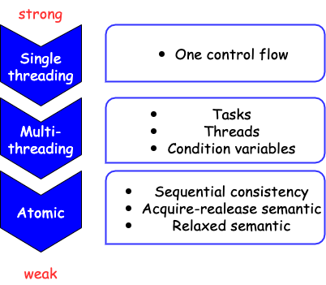
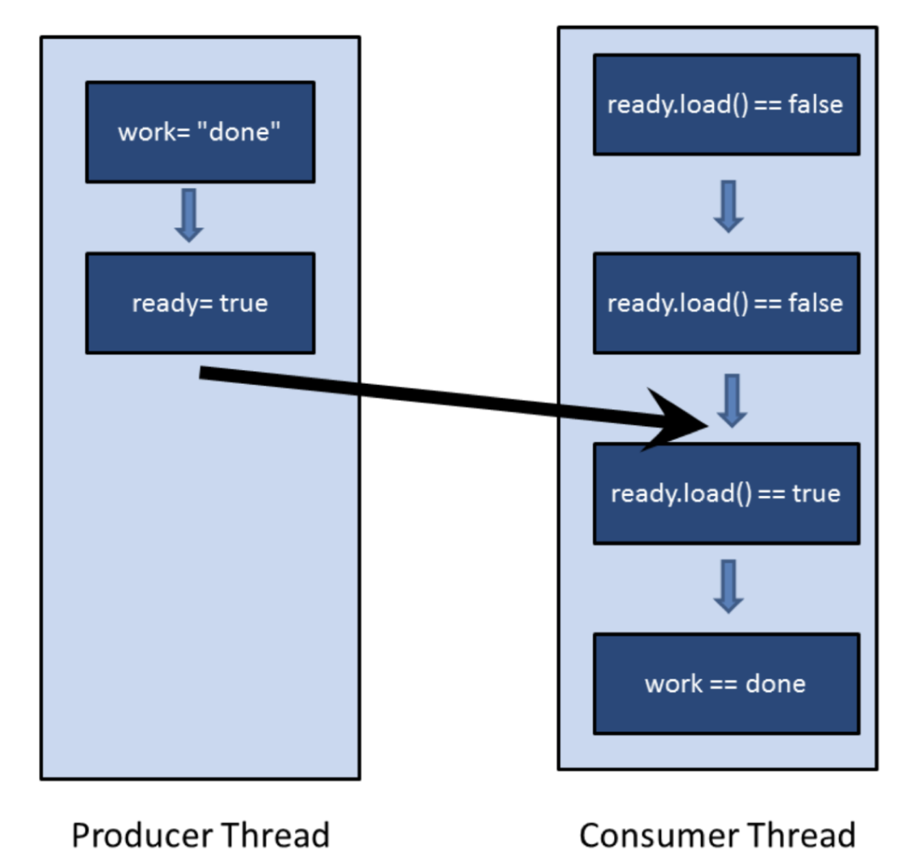
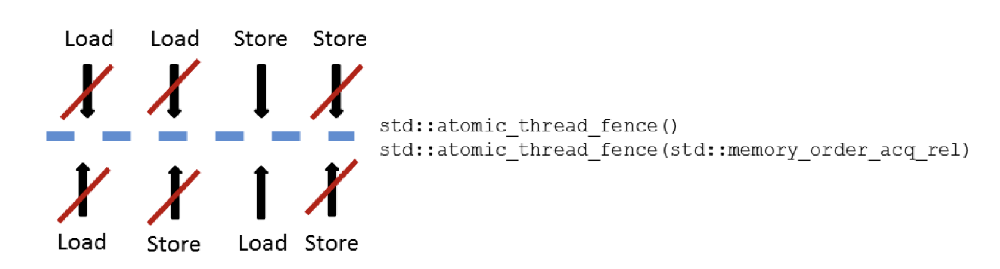
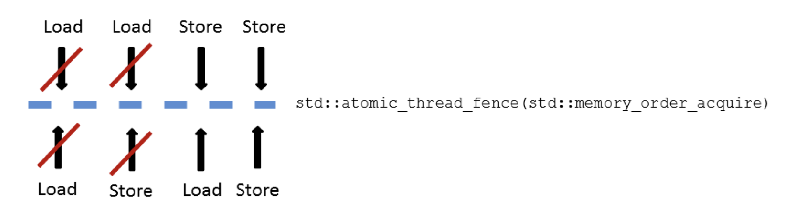
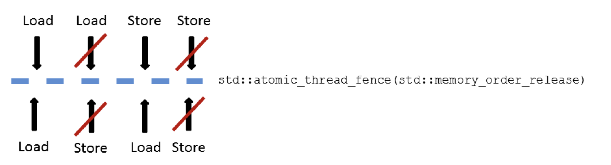
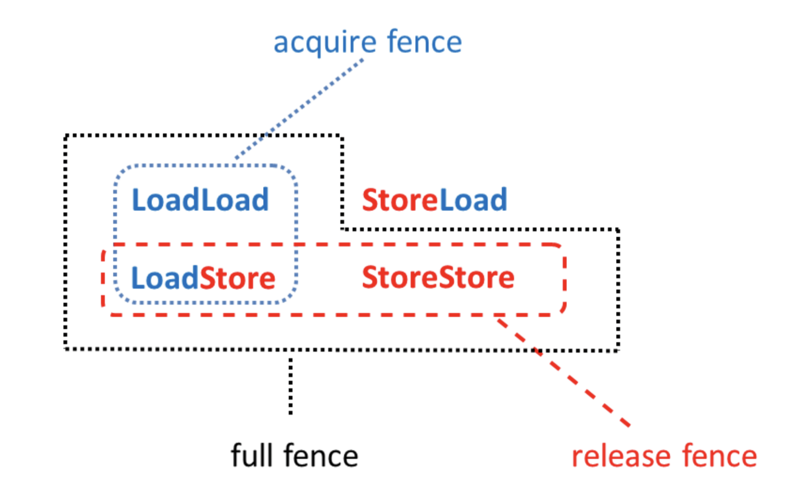
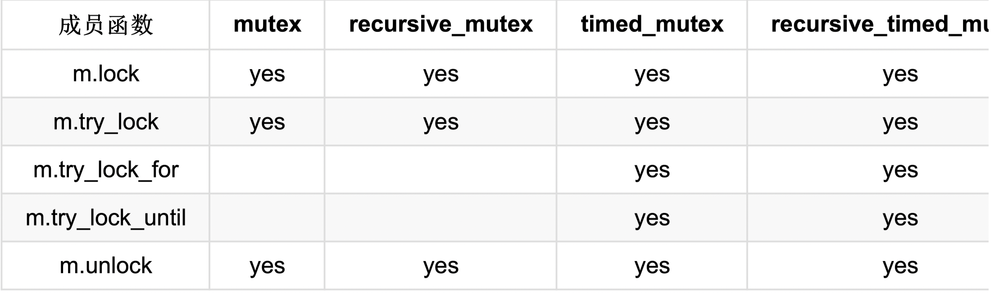
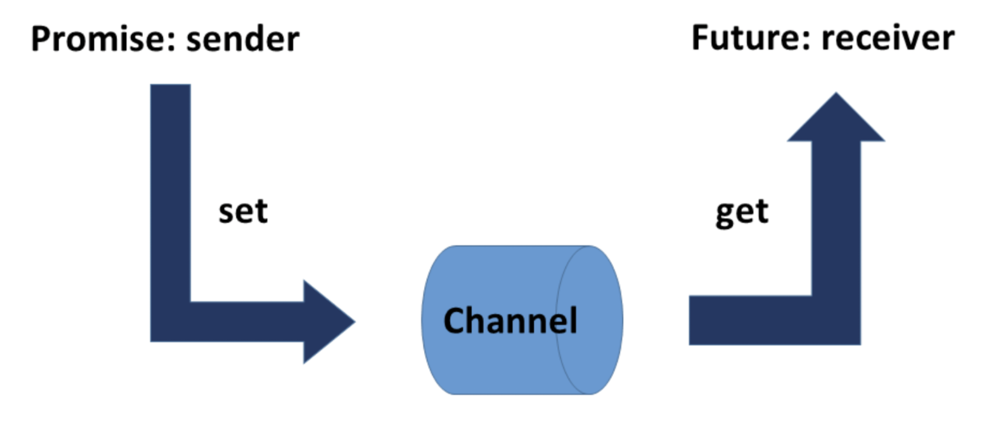

## 内存模型
内存位置：
  * 标量对象(算术类型，枚举类型，指针类型或`std::nullptr_t`)
  * 非零长度的连续队列。

`C++`并发开发的协议：
* 系统：由生成机器码的编译器、执行机器码的处理器和存储程序状态的缓存组成。每个部分可以进行优化,例如:编译器可以使用寄存器或修改循环,处理器可以乱序执行或分支预测,缓存指令可以预取或缓冲。生成的(在好的情况下)可执行文件,可以针对硬件平台进行了优化。
* 开发者

`C++ 11`协议的三个级别：


### 原子操作
顺序一致的特点：
* 指令按照源码顺序执行；
* 线程上所有操作都遵循一个全局顺序。

原子操作默认的内存顺序为：`std::memory_order_seq_cst`(顺序一致)。

#### 原子标志
`std::atomic_flag`, 原子标志，可以对其状态进行设置和清除。
必须使用`ATOMIC_FLAG_INIT`进行初始化。
除了`std::atomic_flag`之外，`C++`标准中的原子内部都会使用互斥锁。这些原子类型都会含有一个`is_lock_free`的函数，用来检查原子内部是否使用了互斥锁。

> `std::is_always_lock_free`
> 可以使用`obj.is_lock_free`，在运行时检查原子类型的`obj`实例是否无锁。
> 在`C++17`中，可以通过`constexpr(常量) atomic<type>::is_always_lock_free`,在编译时对每个原子类型进行检查，支持该操作的所有硬件实现都无锁时，才返回`true`。


**自旋锁**
> 自旋锁与互斥锁不同,它并不获取锁。而是,通过频繁地请求锁来获取临界区的访问权。> 不过,这会导致上下文频繁切换(从用户空间到内核空间),虽然充分使用了CPU, 但也浪费了非常多的时钟周期。
> 线程短时间阻塞时,自旋锁非常有效。
> 通常,会将自旋锁和互斥锁组合着使用。
> 首先,在有限的时间内使用自旋锁;如果不成功,则将线程置于等待(休眠)状态。
> 自旋锁不应该在单处理器系统上使用。否则,自旋锁就不仅浪费了资源,而且还会减慢程序处理的速度(最好的情况),或出现死锁(最坏的情况)。

**`spin_lock`实现：**
```cpp
#include <atomic>
#include <iostream>
#include <thread>

class SpinLock {

public:
  void lock() {
    std::cout << "lock" << std::endl;
    while (atomic_flag.test_and_set())
      ;
  }

  void unlock() {
    std::cout << "unlock" << std::endl;
    atomic_flag.clear();
  }

private:
  std::atomic_flag atomic_flag = ATOMIC_FLAG_INIT;
};

SpinLock spin;

void workOnResource() {
  spin.lock();
  spin.unlock();
}

int main() {
  std::thread t1(workOnResource);
  std::thread t2(workOnResource);

  t1.join();
  t2.join();
}

```

### `std::atomic`模板

> **原子类型不可设置为`volatile`。**
> * `volatile`: 不允许特定对象进行读写优化；
> * `std::atomic`: 用来定义线程安全的原子对象。

同步两个线程：
1.使用`condition`：
```cpp
#include <atomic>
#include <condition_variable>
#include <iostream>
#include <mutex>
#include <thread>
#include <vector>

std::vector<int> mySharedWork;
std::mutex mutex_;
std::condition_variable conVar;

bool dataReady{false};

void waitingForWork() {
  std::cout << "Waiting" << std::endl;
  std::unique_lock<std::mutex> lock(mutex_);
  conVar.wait(lock, [] { return dataReady; });
  mySharedWork[1] = 2;
  std::cout << "work done" << std::endl;
}

void setDataReady() {
  mySharedWork = {1, 0, 3};
  {
    std::lock_guard<std::mutex> lock(mutex_);
    dataReady = true;
  }

  std::cout << "Data Ready" << std::endl;
  conVar.notify_one();
}

int main() {
  std::cout << std::endl;
  std::thread t1(waitingForWork);
  std::thread t2(setDataReady);

  t1.join();
  t2.join();

  for (auto &v : mySharedWork) {
    std::cout << v << ' ';
  }

  std::cout << "\n\n";
}
```
使用条件变量可能出现以下不友好的情况：
* 伪唤醒：接收者在没有收到通知时被唤醒；
* 未唤醒：接收者在没有处于等待状态时获得通知。


2. 使用`std::atomic<bool>`:
```cpp
#include <atomic>
#include <chrono>
#include <iostream>
#include <thread>
#include <vector>

std::vector<int> mySharedWork;
std::atomic<bool> dataReadly{false};

void waitingForWork() {
  std::cout << "waiting" << std::endl;
  while (!dataReadly.load()) {
    std::this_thread::sleep_for(std::chrono::microseconds(5));
  }
  mySharedWork[1] = 2;
  std::cout << "work done" << std::endl;
}

void setDataReady() {
  mySharedWork = {1, 0, 3};
  dataReadly = true;
  std::cout << "Data Prepared" << std::endl;
}

int main() {
  std::cout << std::endl;

  std::thread t1{waitingForWork};
  std::thread t2{setDataReady};

  t1.join();
  t2.join();

  for (auto &it : mySharedWork) {
    std::cout << it << ' ';
  }

  std::cout << std::endl;
}
```

**推拉原理**
> 条件变量让线程等待通知(`condVar.notify()`)。
> 检查`std::atomic<bool>`的线程只是为了确定对方是否完成了工作。

`std::atomic<bool>和std::atomic`的全/偏特化都支持：
`compare_exchange_strong 和 compare_exchange_weak`:

> `compare_exchange_strong`声明为`bool compare_exchange_strong(T &expected, T &descried)`,比较与交换，在`C++`中`atomicVal.compare_exchange_strong(expected, desired)`具有以下行为：
>   * 如果`atomicVal`与期望值`expected`比较返回`true`，则将`atomicVal`的值设置为`desired`；
>   * 如果比较返回`false`，则将`atomicVal`的值设置为`expected`。

> `compare_exchange_weak`
> `weak`可能出现伪失败，意味着`*atomicValue == expected`成立，但`atomicValue`没有被设置成`desired`,函数返回`false`；
> 因此必须在循环中检查:`while(!atomicValue.compare_exchange_weak(expected, desired))`.
> 弱形式存在的原因：一些处理器不支持原子的比较交换指令，循环调用时，首选弱指令。

### 用户定义类型的原子操作(`std::atomic<user-defined type>`)
自定义原子类型的限制：
  * 自定义类型对所有基类和有非静态成员的赋值操作必须非常简单；意味着不能定义复制赋值操作符，但可以使用`default`来完成这个操作符的定义；
  * 自定义类型不能有虚基类和虚方法；
  * 自定义类型必须可按位比较，这样才可以使用`memcpy`和`memcmp`方法。

> 编译时类型检查
> 可以使用以下函数在编译时检查自定义类型的属性：
> `std::is_trivially_copy_constructible, std::is_polymorphic和std::is_trivial`
> 这些函数都是类型特征库(`type-traits library`)的一部分。

```cpp
#include <iostream>
#include <type_traits>

struct A {};

struct B {
  B(const B &) {}
};

struct C {
  virtual void fn() {}
};

struct D {
  int m;
};

struct E {
  virtual void foo();
};

struct F : E {};

int main() {
  std::cout << std::boolalpha;
  std::cout << "is_trivially_copy_constructible:"
            << std::endl; // 检测是否为普通可复制构造
  std::cout << "int : " << std::is_trivially_copy_constructible<int>::value
            << std::endl;
  std::cout << "A : " << std::is_trivially_copy_constructible<A>::value
            << std::endl;
  std::cout << "B : " << std::is_trivially_copy_constructible<B>::value
            << std::endl;
  std::cout << "C : " << std::is_trivially_copy_constructible<C>::value
            << std::endl;

  // 若 T 为多态类（即声明或继承至少一个虚函数的非联合类），则提供等于 true
  // 的成员常量 value 。对于任何其他类型， value 为 false 。
  // 若 T 是非联合类类型，则 T 应为完整类型；否则行为未定义。
  //  添加 is_polymorphic 或 is_polymorphic_v(C++ 17 起)
  //  的特化的程序行为未定义。
  std::cout << "is_polymorphic:" << std::endl;
  std::cout << "int: " << std::is_polymorphic<int>::value << std::endl;
  std::cout << "A: " << std::is_polymorphic<A>::value << std::endl;
  std::cout << "B: " << std::is_polymorphic<B>::value << std::endl;
  std::cout << "C: " << std::is_polymorphic<C>::value << std::endl;

  return 0;
}
```

#### `std::atomic<T*>`
类模板`std::atomic`的偏特化。其行为类似普通指针`T*`.
支持前后递增，前后递减和指针运算。
```cpp
#include <atomic>
#include <cassert>
#include <iostream>

int main(int argc, char **argv) {

  int intArray[5];
  std::atomic<int *> p(intArray);
  p++;
  assert(p.load() == &intArray[1]);
  p += 1;
  assert(p.load() == &intArray[2]);
  p -= 1;
  assert(p.load() != &intArray[1]);
}

```
### `std::shared_ptr`
唯一可以使用原子操作的非原子数据类型。
`std::shared_ptr`:
1. `std::shared_ptr` 可以被多个线程同时访问(仅`const`方式访问)；
2. 不同的`std::shared`实例可以被多个线程同时写。

```cpp
#include <atomic>
#include <memory>
#include <thread>

int main(int argc, char **argv) {
  std::shared_ptr<int> ptr = std::make_shared<int>(2011);

  for (auto i = 0; i < 10; i++) {
    std::thread([ptr] { // ptr 传入复制值
      std::shared_ptr<int> localPtr(
          ptr); // 采用复制构造，每个线程都有自己的一份数据
      localPtr = std::make_shared<int>(2014); // 修改线程内数据的值，不影响ptr
    })
        .detach();
  }

  for (auto i = 0; i < 10; i++) {
    std::thread([&ptr] {                  // ptr 传入引用
      std::shared_ptr<int> localPtr(ptr); // 产生数据竞争，未定义行为
    })
        .detach();
  }
}
```
可以通过如下方式，绕开数据竞争：
```cpp
#include <atomic>
#include <memory>
#include <thread>

int main(int argc, char **argv) {
  std::shared_ptr<int> ptr = std::make_shared<int>(2011);

  for (auto i = 0; i < 10; i++) {
    std::thread([ptr] { // ptr 传入复制值
      std::shared_ptr<int> localPtr(
          ptr); // 采用复制构造，每个线程都有自己的一份数据
      localPtr = std::make_shared<int>(2014); // 修改线程内数据的值，不影响ptr
    })
        .detach();
  }

  std::shared_ptr<int> ptr1 = std::make_shared<int>(2011);
  for (auto i = 0; i < 10; i++) {
    std::thread([&ptr1] {
      auto localPtr = std::make_shared<int>(2014);
      std::atomic_store(&ptr1, localPtr); // 避免产生竞争
    }).detach();
  }
}
```

### 同步和顺序
`C++`中的六种内存序：
```cpp
enum memory_order {
  memory_order_relaxed,
  memory_order_consume,
  memory_order_acquire,
  memory_order_release,
  memory_order_acq_rel,
  memory_order_seq_cst
};
```
##### 原子操作的种类
* 读(`read`)操作：`memory_order_acquire和memory_order_consume`;
* 写(`write`)操作：`memory_order_release`;
* 读改写操作(`read-modify-write`):`memory_order_acq_rel和memory_order_seq_cst`

`memory_order_relaxed`无同步和操作顺序。

如果将操作`atomVar.load()`和“写或读改写”一起使用，那么写部分不起作用。
> `atomVar.load(std::memory_order_acq_rel)` < === > `atomVar.load(std::memory_order_acquire)`
> `atomVar.load(std::memory_order_realease)` < === > `atomVar.load(std::memory_order_relaxed)`

#### 同步和顺序的不同
* 顺序一致：`memory_order_seq_cst`
* 获取释放(`Acquire-release`) : `memory_order_consume, memory_order_acquire, memory_order_release和memory_order_acq_rel`
* 自由序(`Relaxed`): `memory_order_relaxed`

顺序一致：在线程间建立全局顺序；
获取释放：为不同线程间对同一原子变量进行读写时建立顺序；
自由序：只保证原子变量的修改顺序。

修改顺序：对一个特定的原子变量的所有修改都按照特定的顺序发生。

##### 顺序一致
所有线程的所有操作都遵循一个通用时钟。
缺点：系统必须对线程进行同步。
```cpp
#include <atomic>
#include <iostream>
#include <memory>
#include <string>
#include <thread>

std::string work;
std::atomic<bool> ready{false};

void consumer() {
  while (!ready.load()) {
  }

  std::cout << work << std::endl;
}

void product() {
  work = "done";
  ready = true;
}

int main(int argc, char **argv) {
  std::thread proc{product};
  std::thread con{consumer};

  proc.join();
  con.join();
}

```


##### 获取释放语义
线程不存在全局同步，只有在同一个原子变量的原子操作才进行同步。
基本思想：获取和释放在同一个原子上同步，并建立一个顺序。
```cpp
#include <atomic>
#include <thread>

class SpinLock {
public:
  SpinLock() : _flag(ATOMIC_FLAG_INIT) {
  }

  void lock() {
    while (_flag.test_and_set(std::memory_order_acquire))
      ;
  }

  void unlock() {
    _flag.clear(std::memory_order_release);
  }

private:
  std::atomic_flag _flag;
};

SpinLock slock;

void WorkOnResrce() {
  slock.lock();
  slock.unlock();
}

int main(int argc, char **argv) {
  std::thread p1{WorkOnResrce};
  std::thread p2{WorkOnResrce};

  p1.join();
  p2.join();
}
```
##### 传递性
获得-释放语义是可传递的。如果两个线程`(a,b)`之间遵循获取-释放语义,且线程`(b,c)`之间也遵循获取-释放语义,那么在线程`(a, c)`之间也遵循获取-释放语义。
多用于两个线程没有相同的原子变量。
```cpp
#include <atomic>
#include <iostream>
#include <thread>
#include <vector>

std::vector<int>  mySharedWork;
std::atomic<bool> dataProduced{false};
std::atomic<bool> dataConsume{false};

void dataProducer() {
  mySharedWork = {1, 3, 4};
  dataProduced.store(true, std::memory_order_release);
}

void delverBoy() {
  while (!dataProduced.load(std::memory_order_acquire))
    ;

  dataConsume.store(true, std::memory_order_release);
}

void dataConsumer() {
  while (!dataConsume.load(std::memory_order_acquire))
    ;
  mySharedWork[1] = 1;
}

int main(int argc, char **argv) {
  std::cout << std::endl;

  for (auto &item : mySharedWork) {
    std::cout << item << " ";
  }
  std::cout << std::endl;

  std::thread t1{dataConsumer};
  std::thread t2{delverBoy};
  std::thread t3{dataProducer};

  t1.join();
  t2.join();
  t3.join();

  for (auto &item : mySharedWork) {
    std::cout << item << " ";
  }
  std::cout << std::endl;
}

```
释放语义：
```cpp
#include <atomic>
#include <iostream>
#include <mutex>
#include <thread>

std::atomic<int> atom{0};
int              someThingShared{0};

using namespace std::chrono_literals;

void wirteShared() {
  someThingShared = 2;
  atom.store(2, std::memory_order_release);
}

void readShared() {
  while (!(atom.fetch_sub(1, std::memory_order_acquire) > 0)) {
    std::this_thread::sleep_for(100ms);
  }

  std::cout << "someThingShared: " << someThingShared << std::endl;
}

int main(int argc, char **argv) {
  std::cout << std::endl;

  std::thread t1{wirteShared};
  std::thread t2{readShared};
  std::thread t3{readShared};

  t1.join();
  t2.join();
  t3.join();

  std::cout << "atom: " << atom << std::endl;

  std::cout << std::endl;
}
```
> 释放顺序
> 由一个释放操作A和一个原子对象M组成，修改M的顺序会对最大连续子操作序列有所影响，
> 也就是A的第一次调用和随后由相同线程执行的*操作，*是指对原子的读改写操作。

获取-释放序
```cpp
#include <atomic>
#include <iostream>
#include <string>
#include <thread>

using namespace std;

atomic<string *> ptr;
int              pdata;
atomic<int>      atoData;

void produnctor() {
  string *p = new string("c++11");
  pdata     = 2011;
  atoData.store(2014, std::memory_order_relaxed);
  ptr.store(p, std::memory_order_release);
}

void consumer() {
  string *p2;
  while (!(p2 = ptr.load(std::memory_order_acquire)))
    ;

  cout << "*p2: " << *p2 << endl;
  cout << "data: " << pdata << endl;
  cout << "atoData: " << atoData.load(std::memory_order_relaxed) << endl;
}

int main() {
  std::thread t1{produnctor};
  std::thread t2{consumer};

  t1.join();
  t2.join();

  std::cout << endl;
}
```
释放-消费序
```cpp
#include <atomic>
#include <iostream>
#include <string>
#include <thread>

using namespace std;

atomic<string *> ptr;
int              pdata;
atomic<int>      atoData;

void produnctor() {
  string *p = new string("c++11");
  pdata     = 2011;
  atoData.store(2014, std::memory_order_relaxed);
  ptr.store(p, std::memory_order_release);
}

void consumer() {
  string *p2;
  while (!(p2 = ptr.load(std::memory_order_consume)))
    ;

  cout << "*p2: " << *p2 << endl;
  cout << "data: " << pdata << endl;
  cout << "atoData: " << atoData.load(std::memory_order_relaxed) << endl;
}

int main() {
  std::thread t1{produnctor};
  std::thread t2{consumer};

  t1.join();
  t2.join();

  std::cout << endl;
}
```
自由语义
```cpp
#include <atomic>
#include <iostream>
#include <thread>
#include <vector>

std::atomic<int> count = {0};

void add() {
  for (int i = 0; i < 1000; i++) {
    count.fetch_add(1, std::memory_order_relaxed);
  }
}

int main() {
  std::vector<std::thread> v;

  for (int i = 0; i < 10; i++) {
    v.emplace_back(add);
  }

  for (auto &t : v) {
    t.join();
  }

  std::cout << count << std::endl;
}
```
#### 栅栏
`C++`支持以下两种栅栏： `std::atomic_thread_fence`和`std::atomic_signal_fence`
`std::atomic_thread_fence`: 同步线程之间的访问内存；
`std::atomic_signal_fence`: 线程内信号间的同步。

`std::atomic_thread_fence`: 可以阻止特定的操作翻过栅栏。不需要原子变量，通常称为栅栏或原子屏障。
特定的操作主要指：
* 读写操作；
* 加载/存储操作。

`if (resultRead) return result` 就是一个加载操作后跟着一个存储操作。
有四种不同的方式来组合加载/存储操作：
* 加载-加载：一个加载后跟着一个加载操作；
* 加载-存储：一个加载后跟着一个存储操作；
* 存储-加载：一个存储操作后跟着一个加载操作；
* 存储-存储：一个存储操作后跟着一个存储操作。

三种栅栏类型：
全栅(`full fence`): 任意两个操作之间使用完成的栅栏`std::atomic_thread_fence`。可以避免这些操作的重新排序。不过对存储-加载操作，可能会被重新排序；
获取栅栏(`acquire fence`): `std::atomic_thread_fence(std::memory_order_acquire)`避免在获取栅栏之前的读操作，被获取栅栏之后的读或写重新排序；
释放栅栏(`release fence`)：`std::atomic_thread_fence(std::memory_order_release)`避免释放栅栏之后的写操作，在释放栅栏之前通过读或写操作重新排序。





```cpp
#include <atomic>
#include <iostream>
#include <string>
#include <thread>

std::atomic<std::string *> ptr;
int                        data;
std::atomic<int>           atoData;

void producer() {
  std::string *p = new std::string("c++11");
  data           = 2011;
  atoData.store(2014, std::memory_order_relaxed);
  std::atomic_thread_fence(std::memory_order_release);
  ptr.store(p, std::memory_order_release);
}

void consumer() {
  std::string *p;
  while (!(p = ptr.load(std::memory_order_acquire)))
    ;

  std::atomic_thread_fence(std::memory_order_acquire);
  std::cout << "*p = " << *p << std::endl;
  std::cout << "data = " << data << std::endl;
  std::cout << "atoData = " << atoData.load(std::memory_order_relaxed)
            << std::endl;
}

int main() {
  std::thread t1{consumer};
  std::thread t2{producer};

  t1.join();
  t2.join();

  delete ptr;
}
```
`std::atomic_signal_fence`: 在线程和信号句柄之间，建立了非原子和自由原子访问的同步序。
```cpp
#include <atomic>
#include <cassert>
#include <csignal>
#include <thread>

std::atomic<bool> a{false};
std::atomic<bool> b{false};

extern "C" void handler(int) {
  if (a.load(std::memory_order_relaxed)) {
    std::atomic_signal_fence(std::memory_order_relaxed);
    assert(b.load(std::memory_order_relaxed));
  }
}

int main() {
  std::signal(SIGTERM, handler);

  b.store(true, std::memory_order_relaxed);
  std::atomic_signal_fence(std::memory_order_release);
  a.store(true, std::memory_order_relaxed);
}
```

### 多线程
```cpp
#include <iostream>
#include <thread>

void helloFunction() {
  std::cout << "Hello from a function" << std::endl;
}

class HelloFunctionObject {
public:
  void operator()() const {
    std::cout << "Hello From a function object" << std::endl;
  }
};

int main() {
  std::cout << std::endl;
  std::thread t1{helloFunction};

  HelloFunctionObject helloFunctionObject;
  std::thread         t2{helloFunctionObject};

  std::thread t3{[] {
    std::cout << "Hello from a lambda" << std::endl;
  }};

  t1.join();
  t2.join();
  t3.join();
}
```
#### 线程的生命周期
`thread_id`:
```cpp
#include <iostream>
#include <thread>

int main() {
  std::thread t{[] {
    std::cout << std::this_thread::get_id() << std::endl;
  }};

  t.join();
}
```
线程参数：
```cpp
#include <chrono>
#include <iostream>
#include <thread>

class Sleeper {
public:
  Sleeper(int &i_) : i(i_) {
  }

  void operator()(int k) {
    for (unsigned int j = 0; j <= 5; j++) {
      std::this_thread::sleep_for(std::chrono::microseconds(100));
      i += k;
    }

    std::cout << std::this_thread::get_id() << std::endl;
  }

private:
  int &i;
};

int main() {
  int valSleeper = 1000;

  std::thread t{Sleeper(valSleeper), 5};
  // t.detach();
  t.join();

  std::cout << "valSleeper = " << valSleeper << std::endl;
}

```
线程方法：
```cpp
#include <iostream>
#include <thread>

int main() {
  std::cout << std::boolalpha << std::endl;

  std::cout << "hardware concurrency = " << std::thread::hardware_concurrency()
            << std::endl;

  std::thread t1{[] {
    std::cout << "t1 with id = " << std::this_thread::get_id() << std::endl;
  }};

  std::thread t2{[] {
    std::cout << "t2 with id = " << std::this_thread::get_id() << std::endl;
  }};

  std::cout << std::endl;
  std::cout << "FROM MAIN: id of t1 " << t1.get_id() << std::endl;
  std::cout << "FROM MAIN: id of t2 " << t2.get_id() << std::endl;

  std::cout << std::endl;
  std::swap(t1, t2);
  std::cout << "FROM MAIN: id of t1 " << t1.get_id() << std::endl;
  std::cout << "FROM MAIN: id of t2 " << t2.get_id() << std::endl;

  std::cout << "FROM MAIN: id of main " << std::this_thread::get_id()
            << std::endl;

  std::cout << std::endl;
  std::cout << "t1 joinable " << t1.joinable() << std::endl;

  t1.join();
  t2.join();

  std::cout << std::endl;
  std::cout << "t1 joinable " << t1.joinable() << std::endl;
}

```
#### 共享数据
未使用同步限制：
```cpp
#include <chrono>
#include <iostream>
#include <thread>

class Worker {
public:
  Worker(std::string name) : name_(name) {
  }

  void operator()() {
    for (int i = 1; i <= 3; i++) {
      std::this_thread::sleep_for(std::chrono::microseconds(200));
      std::cout << name_ << " : Worker " << i << " Done! " << std::endl;
    }
  }

private:
  std::string name_;
};

int main() {
  std::cout << std::endl;
  std::cout << "Boss : Let's Start Worker!";

  std::thread herb   = std::thread{Worker("Herb")};
  std::thread andrei = std::thread{Worker(" Andei")};
  std::thread scott  = std::thread{Worker("  Scott")};
  std::thread bjarne = std::thread{Worker(" Bjarne")};
  std::thread bart   = std::thread{Worker(" Bart")};
  std::thread jenne  = std::thread{Worker("  Jenne")};

  herb.join();
  andrei.join();
  scott.join();
  bjarne.join();
  bart.join();
  jenne.join();

  std::cout << "Go Home!" << std::endl;
}
```
##### 互斥量
确保任何时候都只有一个线程可以访问临界区。
```cpp
#include <chrono>
#include <iostream>
#include <mutex>
#include <thread>

std::mutex mutex_;

class Worker {
public:
  Worker(std::string name) : name_(name) {
  }

  void operator()() {
    for (int i = 1; i <= 3; i++) {
      std::this_thread::sleep_for(std::chrono::microseconds(200));
      mutex_.lock();
      std::cout << name_ << " : Worker " << i << " Done! " << std::endl;
      mutex_.unlock();
    }
  }

private:
  std::string name_;
};

int main() {
  std::cout << std::endl;
  std::cout << "Boss : Let's Start Worker!";

  std::thread herb   = std::thread{Worker("Herb")};
  std::thread andrei = std::thread{Worker(" Andei")};
  std::thread scott  = std::thread{Worker("  Scott")};
  std::thread bjarne = std::thread{Worker(" Bjarne")};
  std::thread bart   = std::thread{Worker(" Bart")};
  std::thread jenne  = std::thread{Worker("  Jenne")};

  herb.join();
  andrei.join();
  scott.join();
  bjarne.join();
  bart.join();
  jenne.join();

  std::cout << "Go Home!" << std::endl;
}
```
`std::cout, std::cin, std::cerr, std::clog`均是线程安全的。


`std::shared_time_mutex/std::shared_mutex`可以用来实现读写锁，也可以用来实现独占或共享锁定。
> `std::shared_time_mutex/std::shared_mutex`放入`std::lock_guard/std::unique_lock`中可以实现独占锁；
> `std::shared_time_mutex/std::shared_mutex`放入`std::shared_lock`中可以实现共享锁；
> `m.try_lock_for(relTime)/m.try_lock_shared_for(relTime)`需要一个时间段；
> `m.try_lock_util(abstime)/m.try_lock_shared_util(abstime)`需要一个绝对时间点；

#### 异常和未知代码
锁的四种不同形式：
> 1. `std::shared_lock`用于简单程序；
> 2. `std::unique_lock`用于高级程序；
> 3. `std::shared_lock`实现读写锁；
> 4. `std::scoped_lock`在原子操作中锁定更多的互斥对象。

`std::shared_lock`可以原子的锁定任意数量的互斥量。
`deadlock`死锁解决：
```cpp
#include <chrono>
#include <iostream>
#include <mutex>
#include <thread>

struct Ciritialata {
  std::mutex mutex_;
};

void deadLock(Ciritialata &a, Ciritialata &b) {
  std::unique_lock<std::mutex> guard1{a.mutex_, std::defer_lock};

  std::cout << "Thread: " << std::this_thread::get_id() << " first mutex. "
            << std::endl;

  std::this_thread::sleep_for(std::chrono::microseconds(1));
  std::unique_lock<std::mutex> guard2{b.mutex_, std::defer_lock};
  std::cout << "Thread: " << std::this_thread::get_id() << " second mutex. "
            << std::endl;
  std::cout << "Thread: " << std::this_thread::get_id() << " both mutex. "
            << std::endl;

  lock(guard1, guard2);
}

int main() {
  Ciritialata c1;
  Ciritialata c2;

  std::thread t1{[&] {
    deadLock(c1, c2);
  }};
  std::thread t2{[&] {
    deadLock(c2, c1);
  }};

  t1.join();
  t2.join();
}
```
使用`std::lock`可以进行原子锁定。
> `std::lock`是一个可变参数模板，可以接受任意数量的参数；
> 尝试使用避免死锁算法，在一个原子步骤获取所有的锁。

使用`std::lock`破坏死锁：
```cpp
#include <chrono>
#include <iostream>
#include <mutex>
#include <thread>

struct Ciritialata {
  std::mutex mutex_;
};

void deadLock(Ciritialata &a, Ciritialata &b) {
  std::lock(a.mutex_, b.mutex_);
  std::lock_guard<std::mutex> guard1{a.mutex_, std::adopt_lock};
  std::lock_guard<std::mutex> guard2{b.mutex_, std::adopt_lock};
  std::cout << "Thread: " << std::this_thread::get_id() << " first mutex. "
            << std::endl;

  std::this_thread::sleep_for(std::chrono::microseconds(1));
  std::cout << "Thread: " << std::this_thread::get_id() << " second mutex. "
            << std::endl;
  std::cout << "Thread: " << std::this_thread::get_id() << " both mutex. "
            << std::endl;
}

int main() {
  Ciritialata c1;
  Ciritialata c2;

  std::thread t1{[&] {
    deadLock(c1, c2);
  }};
  std::thread t2{[&] {
    deadLock(c2, c1);
  }};

  t1.join();
  t2.join();
}
```
在`C++17`中解决死锁，可以使用`std::scoped_lock`原子的锁定任意数量的互斥。
```cpp
#include <chrono>
#include <iostream>
#include <mutex>
#include <thread>

struct Ciritialata {
  std::mutex mutex_;
};

void deadLock(Ciritialata &a, Ciritialata &b) {
  std::scoped_lock(a.mutex_, b.mutex_);
  std::cout << "Thread: " << std::this_thread::get_id() << " first mutex. "
            << std::endl;

  std::this_thread::sleep_for(std::chrono::microseconds(1));
  std::cout << "Thread: " << std::this_thread::get_id() << " second mutex. "
            << std::endl;
  std::cout << "Thread: " << std::this_thread::get_id() << " both mutex. "
            << std::endl;
}

int main() {
  Ciritialata c1;
  Ciritialata c2;

  std::thread t1{[&] {
    deadLock(c1, c2);
  }};
  std::thread t2{[&] {
    deadLock(c2, c1);
  }};

  t1.join();
  t2.join();
}
```
`std::shared_lock`
接口与`std::unique_lock`相同，但是在与`std::shared_time_mutex和std::shared_mutex`一起使用时，效果不同。
多个线程共享一个`std::shared_timed_mutex/std::shared_mutex`可以实现读写锁。
```cpp
#include <chrono>
#include <iostream>
#include <map>
#include <shared_mutex>
#include <string>
#include <thread>

std::map<std::string, unsigned long long> teleBook{{"huyun", 188888888},
                                                   {"qw", 122288282},
                                                   {"as", 1000000}};

std::shared_timed_mutex teleBookMutex;

void addToTeleBook(const std::string &name, unsigned long long number) {
  std::lock_guard<std::shared_timed_mutex> writerLock{teleBookMutex};
  std::cout << "\nTRATING UPDATE " << name;
  std::this_thread::sleep_for(std::chrono::microseconds(500));
  teleBook[name] = number;
  std::cout << " ... ENDING UPDATE" << std::endl;
}

void printNumber(const std::string &name) {
  std::shared_lock<std::shared_timed_mutex> readerLock{teleBookMutex};
  if (teleBook.find(name) == teleBook.end()) {
    std::cout << name << " not found from telebook." << std::endl;
  } else {
    std::cout << name << " : " << teleBook[name] << std::endl;
  }
}

int main() {
  std::thread reader1{[] {
    printNumber("qw");
  }};

  std::thread reader2{[] {
    printNumber("huyun");
  }};

  std::thread w1{[] {
    addToTeleBook("qw", 11111111111);
  }};

  std::thread reader3{[] {
    printNumber("qw");
  }};

  std::thread reader4{[] {
    printNumber("huyun");
  }};

  std::thread w2{[] {
    addToTeleBook("rt", 2222222222);
  }};

  std::thread reader5{[] {
    printNumber("qw");
  }};

  std::thread reader6{[] {
    printNumber("huyun");
  }};

  std::thread reader7{[] {
    printNumber("rt");
  }};

  std::thread reader8{[] {
    printNumber("aaaa");
  }};

  reader1.join();
  reader2.join();
  reader3.join();
  reader4.join();
  reader5.join();
  reader6.join();
  reader7.join();
  reader8.join();
  w1.join();
  w2.join();

  for (auto teleIt : teleBook) {
    std::cout << teleIt.first << ": " << teleIt.second << std::endl;
  }
}
```
#### 线程安全的初始化
`C++`三种线程安全初始化变量的方法：
1. 常量表达式
2. `std::call_once`与`std::once_flag`结合的方式
3. 作用域的静态变量

用户自定义类型也可以是常量表达式，只要满足以下条件：
* 不能有虚方法或虚基类；
* 构造函数必须为空，且本身为常量表达式；
* 必须初始化每个基类和每个非静态成员；
* 成员函数在编译时应该是可调用的，必须是常量表达式。

```cpp
#include <iostream>

class MyDouble {
public:
  constexpr MyDouble(double v1, double v2) : myVal1(v1), myVal2(v2) {
  }

  constexpr double getSum() const {
    return myVal1 + myVal2;
  }

private:
  double myVal1;
  double myVal2;
};

int main() {
  constexpr double   myStatVal = 2.0;
  constexpr MyDouble mydouble{10.5, myStatVal};
  constexpr double   sumStat = mydouble.getSum();

  std::cout << sumStat << std::endl;
}
```
#### `std::call_once和std::once_flag`
通过`std::call_once`注册一个可调用单元。
`std::once_flag`确保注册函数只能调用一次。
可以通过`std::once_flag`注册一组函数，但是只能调用注册函数组中的一个。
`std::call_once`的规则：
* 只执行其中一个函数一次，未定义选择哪个函数执行。所选函数与`std::call_once`在同一线程中执行；
* 在上述所选函数执行成功完成之前，不返回任何调用；
* 如果函数异常退出则将其传播至调用处。然后执行另外一个函数。

```cpp
#include <iostream>
#include <mutex>
#include <thread>

std::once_flag onceFlag;

void doOnce() {
  std::call_once(onceFlag, [] {
    std::cout << "do once" << std::endl;
  });
}

void doOnce1() {
  std::call_once(onceFlag, [] {
    std::cout << "do once 2" << std::endl;
  });
}

int main() {
  std::thread t1{doOnce};
  std::thread t2{doOnce};
  std::thread t3{doOnce1};
  std::thread t4{doOnce1};

  t1.join();
  t2.join();
  t3.join();
  t4.join();
}
```
仅输出 `do once`一次。
单例模式实现：
```cpp
#include <iostream>
#include <mutex>
#include <thread>

class SingleTon {
public:
  SingleTon(const SingleTon &) = delete;
  SingleTon &operator=(const SingleTon &) = delete;

  static SingleTon *getInstance() {
    std::call_once(initInstanceFlag, initSingleTon);
    return instance;
  }

  static void initSingleTon() {
    instance = new SingleTon();
  }

  static void del_object() {
    std::call_once(destoryInstanceFlag, destryObject);
  }

  static void destryObject() {
    if (instance) {
      delete instance;
      instance = nullptr;
    }
  }

private:
  static std::once_flag initInstanceFlag;
  static std::once_flag destoryInstanceFlag;

  static SingleTon *instance;
  SingleTon()  = default;
  ~SingleTon() = default;
};

SingleTon     *SingleTon::instance = nullptr;
std::once_flag SingleTon::initInstanceFlag;
std::once_flag SingleTon::destoryInstanceFlag;

void threadRun() {
  std::cout << "Thread id : " << std::this_thread::get_id()
            << " ,SingleTon getInstance " << SingleTon::getInstance()
            << std::endl;
}

int main() {
  std::cout << "Thread id : " << std::this_thread::get_id()
            << " ,SingleTon getInstance " << SingleTon::getInstance()
            << std::endl;

  std::thread t1{threadRun};
  std::thread t2{threadRun};

  t1.join();
  t2.join();

  std::cout << "Thread id : " << std::this_thread::get_id()
            << " ,SingleTon getInstance " << SingleTon::getInstance()
            << std::endl;
  SingleTon::del_object();
}
```
有作用域的静态变量
```cpp
#include <iostream>
#include <thread>

class SingleTon {
public:
  static SingleTon &getInstance() {
    static SingleTon instance;

    return instance;
  }

private:
  SingleTon()  = default;
  ~SingleTon() = default;

  SingleTon(const SingleTon &) = delete;
  SingleTon &operator=(const SingleTon &) = delete;
};

void threadRun() {
  std::cout << "threadid : " << std::this_thread::get_id()
            << " ,singleton address : " << &SingleTon::getInstance()
            << std::endl;
}

int main() {
  std::cout << "threadid : " << std::this_thread::get_id()
            << " ,singleton address : " << &SingleTon::getInstance()
            << std::endl;

  std::thread t1{threadRun};
  std::thread t2{threadRun};

  t1.join();
  t2.join();

  std::cout << "threadid : " << std::this_thread::get_id()
            << " ,singleton address : " << &SingleTon::getInstance()
            << std::endl;
}
```
#### 线程-本地数据(`thread-local`)
为每个线程单独创建，行为类似于静态数据。
在命名空间范围内，或作为静态成员的局部变量，在第一次使用之前创建；
在函数中线程局部变量是第一次使用时创建，并且线程本地数据只属于线程。
```cpp
#include <iostream>
#include <mutex>
#include <string>
#include <thread>

std::mutex countMutex;

thread_local std::string s{"hello from "};

void addThreadLocal(std::string const &s2) {
  s += s2;
  std::lock_guard<std::mutex> guard{countMutex};
  std::cout << s << std::endl;
  std::cout << "&s : " << &s << std::endl;
  std::cout << std::endl;
}

int main() {
  std::thread t1{addThreadLocal, "t1"};
  std::thread t2{addThreadLocal, "t2"};
  std::thread t3{addThreadLocal, "t3"};
  std::thread t4{addThreadLocal, "t4"};
  std::thread t5{addThreadLocal, "t5"};
  std::thread t6{addThreadLocal, "t6"};

  t1.join();
  t2.join();
  t3.join();
  t4.join();
  t5.join();
  t6.join();

  return 0;
}
```
**静态变量，`thread_local`变量和局部变量之间的区别：**
> 静态变量与主线程的生命周期相同；
> `thread_local`与其所在线程的生存周期相同；
> 局部变量与创建作用域的生存周期相同。

```cpp
#include <iostream>
#include <mutex>
#include <string>
#include <thread>

std::mutex coutMutex;

thread_local std::string s{"hello from : "};

void first() {
  s += " first ";
}

void second() {
  s += " second ";
}

void third() {
  s += " third ";
}

void addThreadLocal(std::string const& s2) {
  s += s2;
  first();
  second();
  third();

  std::lock_guard<std::mutex> lock{coutMutex};
  std::cout << "s = " << s << std::endl;
  std::cout << "&s = " << &s << std::endl;
  std::cout << std::endl;
}

int main() {
  std::thread t1{addThreadLocal, "t1: "};
  std::thread t2{addThreadLocal, "t2: "};
  std::thread t3{addThreadLocal, "t3: "};
  std::thread t4{addThreadLocal, "t4: "};

  t1.join();
  t2.join();
  t3.join();
  t4.join();

  return 0;
}
```

> 线程本地数据有助于将单线程程序移植成多线程程序；
> 如果全局变量是线程局部的，则可以保证每个线程都得到其数据副本，从而避免数据竞争。

#### 条件变量
```cpp
#include <condition_variable>
#include <iostream>
#include <mutex>
#include <thread>

std::mutex mutex_;

std::condition_variable condVar;

bool dataReady{false};

void doTheWork() {
  std::cout << "Processing the shared data" << std::endl;
}

void waitngForWork() {
  std::cout << "Worker: Waiting for work." << std::endl;
  std::unique_lock<std::mutex> lck{mutex_};

  condVar.wait(lck, [] {
    return dataReady;
  });

  doTheWork();
  std::cout << " done work " << std::endl;
}

void setDataReady() {
  {
    std::lock_guard<std::mutex> lck{mutex_};
    dataReady = true;
  }

  condVar.notify_one();
}

int main() {
  std::thread t1{setDataReady};
  std::thread t2{waitngForWork};

  t1.join();
  t2.join();
}
```
> `std::condition_ariable_any`
> 可以等待符合`BasicLockble`的锁类型。

##### 未唤醒和伪唤醒
**未唤醒**
发送方在接收方到达等待状态之前发送通知，导致通知丢失。
**伪唤醒**
没有发送通知，但是接收方被唤醒。

### 任务
`C++`处理异步任务，必须包含一个`<future>`的头文件。
任务由一个参数化工作包和两个组件：`promise, future`组成，两者构建一条数据通道。
`promise`执行工作包并将数据放入数据通道，`future`可以获取结果，两个组件可以运行在不同的线程中。
特别是`future`可以在之后某个时间点获取结果，所以`promise和future`是分开的。
> 将任务视为通信端的数据通道
> 任务的行为类似通信点之间的数据通道。
> 通道一端为`promise`,另一端为`future`.



```cpp
#include <future>
#include <iostream>
#include <thread>

int main() {
  int         res;
  std::thread t{[&] {
    res = 2000 + 11;
  }};

  t.join();

  std::cout << "res : " << res << std::endl;

  auto fut = std::async([] {
    return 2000 + 11;
  });

  std::cout << "fut.get() " << fut.get() << std::endl;
}
```

任务 `VS` 线程

|     标准     |         线程         |        任务         |
| :----------: | :------------------: | :-----------------: |
|   构成元素   |   创建线程和子线程   |  `promise和future`  |
|   通信方式   |       共享变量       |      通信信道       |
|   创建线程   |       必定创建       |        可选         |
|   同步方式   |    通过`join`等待    | 使用`get`阻塞式调用 |
| 线程中的异常 | 子线程和创建线程终止 |  返回`promise`的值  |
|   通信类型   |        变量值        | 变量值，通知和异常  |

`std::async`是创建任务的最简单的方法。

> `srd::async`应该是首选
> `C++`运行时决定`std::async`是否在独立线程中运行；
> 决策可能取决于可用的`CPU`数量，系统的利用率或工作包的大小；
> 使用`std::async`只需要指定运行的任务，`C++`运行时自动管理线程。

##### 启动策略
显式的指定调用是在同一线程中执行(`std::launch::deffered`), 还是在不同线程中执行(`std::launch::async`).

> 及早求值与惰性求值
> 
