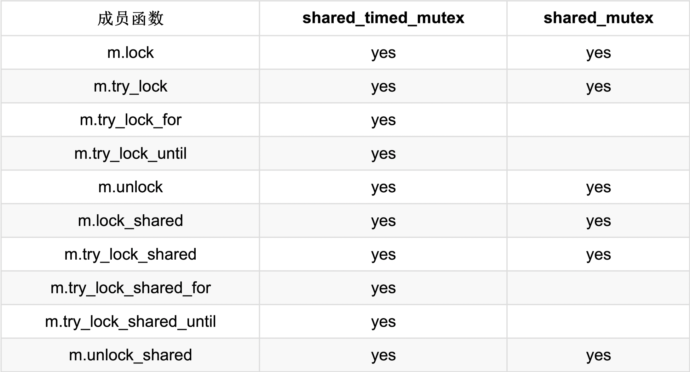

## 内存模型
内存位置：
  * 标量对象(算术类型，枚举类型，指针类型或`std::nullptr_t`)
  * 非零长度的连续队列。

`C++`并发开发的协议：
* 系统：由生成机器码的编译器、执行机器码的处理器和存储程序状态的缓存组成。每个部分可以进行优化,例如:编译器可以使用寄存器或修改循环,处理器可以乱序执行或分支预测,缓存指令可以预取或缓冲。生成的(在好的情况下)可执行文件,可以针对硬件平台进行了优化。
* 开发者

`C++ 11`协议的三个级别：


### 原子操作
顺序一致的特点：
* 指令按照源码顺序执行；
* 线程上所有操作都遵循一个全局顺序。

原子操作默认的内存顺序为：`std::memory_order_seq_cst`(顺序一致)。

#### 原子标志
`std::atomic_flag`, 原子标志，可以对其状态进行设置和清除。
必须使用`ATOMIC_FLAG_INIT`进行初始化。
除了`std::atomic_flag`之外，`C++`标准中的原子内部都会使用互斥锁。这些原子类型都会含有一个`is_lock_free`的函数，用来检查原子内部是否使用了互斥锁。

> `std::is_always_lock_free`
> 可以使用`obj.is_lock_free`，在运行时检查原子类型的`obj`实例是否无锁。
> 在`C++17`中，可以通过`constexpr(常量) atomic<type>::is_always_lock_free`,在编译时对每个原子类型进行检查，支持该操作的所有硬件实现都无锁时，才返回`true`。


**自旋锁**
> 自旋锁与互斥锁不同,它并不获取锁。而是,通过频繁地请求锁来获取临界区的访问权。> 不过,这会导致上下文频繁切换(从用户空间到内核空间),虽然充分使用了CPU, 但也浪费了非常多的时钟周期。
> 线程短时间阻塞时,自旋锁非常有效。
> 通常,会将自旋锁和互斥锁组合着使用。
> 首先,在有限的时间内使用自旋锁;如果不成功,则将线程置于等待(休眠)状态。
> 自旋锁不应该在单处理器系统上使用。否则,自旋锁就不仅浪费了资源,而且还会减慢程序处理的速度(最好的情况),或出现死锁(最坏的情况)。

**`spin_lock`实现：**
```cpp
#include <atomic>
#include <iostream>
#include <thread>

class SpinLock {

public:
  void lock() {
    std::cout << "lock" << std::endl;
    while (atomic_flag.test_and_set())
      ;
  }

  void unlock() {
    std::cout << "unlock" << std::endl;
    atomic_flag.clear();
  }

private:
  std::atomic_flag atomic_flag = ATOMIC_FLAG_INIT;
};

SpinLock spin;

void workOnResource() {
  spin.lock();
  spin.unlock();
}

int main() {
  std::thread t1(workOnResource);
  std::thread t2(workOnResource);

  t1.join();
  t2.join();
}

```

### `std::atomic`模板

> **原子类型不可设置为`volatile`。**
> * `volatile`: 不允许特定对象进行读写优化；
> * `std::atomic`: 用来定义线程安全的原子对象。

同步两个线程：
1.使用`condition`：
```cpp
#include <atomic>
#include <condition_variable>
#include <iostream>
#include <mutex>
#include <thread>
#include <vector>

std::vector<int> mySharedWork;
std::mutex mutex_;
std::condition_variable conVar;

bool dataReady{false};

void waitingForWork() {
  std::cout << "Waiting" << std::endl;
  std::unique_lock<std::mutex> lock(mutex_);
  conVar.wait(lock, [] { return dataReady; });
  mySharedWork[1] = 2;
  std::cout << "work done" << std::endl;
}

void setDataReady() {
  mySharedWork = {1, 0, 3};
  {
    std::lock_guard<std::mutex> lock(mutex_);
    dataReady = true;
  }

  std::cout << "Data Ready" << std::endl;
  conVar.notify_one();
}

int main() {
  std::cout << std::endl;
  std::thread t1(waitingForWork);
  std::thread t2(setDataReady);

  t1.join();
  t2.join();

  for (auto &v : mySharedWork) {
    std::cout << v << ' ';
  }

  std::cout << "\n\n";
}
```
使用条件变量可能出现以下不友好的情况：
* 伪唤醒：接收者在没有收到通知时被唤醒；
* 未唤醒：接收者在没有处于等待状态时获得通知。


2. 使用`std::atomic<bool>`:
```cpp
#include <atomic>
#include <chrono>
#include <iostream>
#include <thread>
#include <vector>

std::vector<int> mySharedWork;
std::atomic<bool> dataReadly{false};

void waitingForWork() {
  std::cout << "waiting" << std::endl;
  while (!dataReadly.load()) {
    std::this_thread::sleep_for(std::chrono::microseconds(5));
  }
  mySharedWork[1] = 2;
  std::cout << "work done" << std::endl;
}

void setDataReady() {
  mySharedWork = {1, 0, 3};
  dataReadly = true;
  std::cout << "Data Prepared" << std::endl;
}

int main() {
  std::cout << std::endl;

  std::thread t1{waitingForWork};
  std::thread t2{setDataReady};

  t1.join();
  t2.join();

  for (auto &it : mySharedWork) {
    std::cout << it << ' ';
  }

  std::cout << std::endl;
}
```

**推拉原理**
> 条件变量让线程等待通知(`condVar.notify()`)。
> 检查`std::atomic<bool>`的线程只是为了确定对方是否完成了工作。

`std::atomic<bool>和std::atomic`的全/偏特化都支持：
`compare_exchange_strong 和 compare_exchange_weak`:

> `compare_exchange_strong`声明为`bool compare_exchange_strong(T &expected, T &descried)`,比较与交换，在`C++`中`atomicVal.compare_exchange_strong(expected, desired)`具有以下行为：
>   * 如果`atomicVal`与期望值`expected`比较返回`true`，则将`atomicVal`的值设置为`desired`；
>   * 如果比较返回`false`，则将`atomicVal`的值设置为`expected`。

> `compare_exchange_weak`
> `weak`可能出现伪失败，意味着`*atomicValue == expected`成立，但`atomicValue`没有被设置成`desired`,函数返回`false`；
> 因此必须在循环中检查:`while(!atomicValue.compare_exchange_weak(expected, desired))`.
> 弱形式存在的原因：一些处理器不支持原子的比较交换指令，循环调用时，首选弱指令。

### 用户定义类型的原子操作(`std::atomic<user-defined type>`)
自定义原子类型的限制：
  * 自定义类型对所有基类和有非静态成员的赋值操作必须非常简单；意味着不能定义复制赋值操作符，但可以使用`default`来完成这个操作符的定义；
  * 自定义类型不能有虚基类和虚方法；
  * 自定义类型必须可按位比较，这样才可以使用`memcpy`和`memcmp`方法。

> 编译时类型检查
> 可以使用以下函数在编译时检查自定义类型的属性：
> `std::is_trivially_copy_constructible, std::is_polymorphic和std::is_trivial`
> 这些函数都是类型特征库(`type-traits library`)的一部分。

```cpp
#include <iostream>
#include <type_traits>

struct A {};

struct B {
  B(const B &) {}
};

struct C {
  virtual void fn() {}
};

struct D {
  int m;
};

struct E {
  virtual void foo();
};

struct F : E {};

int main() {
  std::cout << std::boolalpha;
  std::cout << "is_trivially_copy_constructible:"
            << std::endl; // 检测是否为普通可复制构造
  std::cout << "int : " << std::is_trivially_copy_constructible<int>::value
            << std::endl;
  std::cout << "A : " << std::is_trivially_copy_constructible<A>::value
            << std::endl;
  std::cout << "B : " << std::is_trivially_copy_constructible<B>::value
            << std::endl;
  std::cout << "C : " << std::is_trivially_copy_constructible<C>::value
            << std::endl;

  // 若 T 为多态类（即声明或继承至少一个虚函数的非联合类），则提供等于 true
  // 的成员常量 value 。对于任何其他类型， value 为 false 。
  // 若 T 是非联合类类型，则 T 应为完整类型；否则行为未定义。
  //  添加 is_polymorphic 或 is_polymorphic_v(C++ 17 起)
  //  的特化的程序行为未定义。
  std::cout << "is_polymorphic:" << std::endl;
  std::cout << "int: " << std::is_polymorphic<int>::value << std::endl;
  std::cout << "A: " << std::is_polymorphic<A>::value << std::endl;
  std::cout << "B: " << std::is_polymorphic<B>::value << std::endl;
  std::cout << "C: " << std::is_polymorphic<C>::value << std::endl;

  return 0;
}
```

#### `std::atomic<T*>`
类模板`std::atomic`的偏特化。其行为类似普通指针`T*`.
支持前后递增，前后递减和指针运算。
```cpp
#include <atomic>
#include <cassert>
#include <iostream>

int main(int argc, char **argv) {

  int intArray[5];
  std::atomic<int *> p(intArray);
  p++;
  assert(p.load() == &intArray[1]);
  p += 1;
  assert(p.load() == &intArray[2]);
  p -= 1;
  assert(p.load() != &intArray[1]);
}

```
### `std::shared_ptr`
唯一可以使用原子操作的非原子数据类型。
`std::shared_ptr`:
1. `std::shared_ptr` 可以被多个线程同时访问(仅`const`方式访问)；
2. 不同的`std::shared`实例可以被多个线程同时写。

```cpp
#include <atomic>
#include <memory>
#include <thread>

int main(int argc, char **argv) {
  std::shared_ptr<int> ptr = std::make_shared<int>(2011);

  for (auto i = 0; i < 10; i++) {
    std::thread([ptr] { // ptr 传入复制值
      std::shared_ptr<int> localPtr(
          ptr); // 采用复制构造，每个线程都有自己的一份数据
      localPtr = std::make_shared<int>(2014); // 修改线程内数据的值，不影响ptr
    })
        .detach();
  }

  for (auto i = 0; i < 10; i++) {
    std::thread([&ptr] {                  // ptr 传入引用
      std::shared_ptr<int> localPtr(ptr); // 产生数据竞争，未定义行为
    })
        .detach();
  }
}
```
可以通过如下方式，绕开数据竞争：
```cpp
#include <atomic>
#include <memory>
#include <thread>

int main(int argc, char **argv) {
  std::shared_ptr<int> ptr = std::make_shared<int>(2011);

  for (auto i = 0; i < 10; i++) {
    std::thread([ptr] { // ptr 传入复制值
      std::shared_ptr<int> localPtr(
          ptr); // 采用复制构造，每个线程都有自己的一份数据
      localPtr = std::make_shared<int>(2014); // 修改线程内数据的值，不影响ptr
    })
        .detach();
  }

  std::shared_ptr<int> ptr1 = std::make_shared<int>(2011);
  for (auto i = 0; i < 10; i++) {
    std::thread([&ptr1] {
      auto localPtr = std::make_shared<int>(2014);
      std::atomic_store(&ptr1, localPtr); // 避免产生竞争
    }).detach();
  }
}
```

### 同步和顺序
`C++`中的六种内存序：
```cpp
enum memory_order {
  memory_order_relaxed,
  memory_order_consume,
  memory_order_acquire,
  memory_order_release,
  memory_order_acq_rel,
  memory_order_seq_cst
};
```
##### 原子操作的种类
* 读(`read`)操作：`memory_order_acquire和memory_order_consume`;
* 写(`write`)操作：`memory_order_release`;
* 读改写操作(`read-modify-write`):`memory_order_acq_rel和memory_order_seq_cst`

`memory_order_relaxed`无同步和操作顺序。

如果将操作`atomVar.load()`和“写或读改写”一起使用，那么写部分不起作用。
> `atomVar.load(std::memory_order_acq_rel)` < === > `atomVar.load(std::memory_order_acquire)`
> `atomVar.load(std::memory_order_realease)` < === > `atomVar.load(std::memory_order_relaxed)`

#### 同步和顺序的不同
* 顺序一致：`memory_order_seq_cst`
* 获取释放(`Acquire-release`) : `memory_order_consume, memory_order_acquire, memory_order_release和memory_order_acq_rel`
* 自由序(`Relaxed`): `memory_order_relaxed`

顺序一致：在线程间建立全局顺序；
获取释放：为不同线程间对同一原子变量进行读写时建立顺序；
自由序：只保证原子变量的修改顺序。

修改顺序：对一个特定的原子变量的所有修改都按照特定的顺序发生。

##### 顺序一致
所有线程的所有操作都遵循一个通用时钟。
缺点：系统必须对线程进行同步。
```cpp
#include <atomic>
#include <iostream>
#include <memory>
#include <string>
#include <thread>

std::string work;
std::atomic<bool> ready{false};

void consumer() {
  while (!ready.load()) {
  }

  std::cout << work << std::endl;
}

void product() {
  work = "done";
  ready = true;
}

int main(int argc, char **argv) {
  std::thread proc{product};
  std::thread con{consumer};

  proc.join();
  con.join();
}

```


##### 获取释放语义
线程不存在全局同步，只有在同一个原子变量的原子操作才进行同步。
基本思想：获取和释放在同一个原子上同步，并建立一个顺序。
```cpp
#include <atomic>
#include <thread>

class SpinLock {
public:
  SpinLock() : _flag(ATOMIC_FLAG_INIT) {
  }

  void lock() {
    while (_flag.test_and_set(std::memory_order_acquire))
      ;
  }

  void unlock() {
    _flag.clear(std::memory_order_release);
  }

private:
  std::atomic_flag _flag;
};

SpinLock slock;

void WorkOnResrce() {
  slock.lock();
  slock.unlock();
}

int main(int argc, char **argv) {
  std::thread p1{WorkOnResrce};
  std::thread p2{WorkOnResrce};

  p1.join();
  p2.join();
}
```
##### 传递性
获得-释放语义是可传递的。如果两个线程`(a,b)`之间遵循获取-释放语义,且线程`(b,c)`之间也遵循获取-释放语义,那么在线程`(a, c)`之间也遵循获取-释放语义。
多用于两个线程没有相同的原子变量。
```cpp
#include <atomic>
#include <iostream>
#include <thread>
#include <vector>

std::vector<int>  mySharedWork;
std::atomic<bool> dataProduced{false};
std::atomic<bool> dataConsume{false};

void dataProducer() {
  mySharedWork = {1, 3, 4};
  dataProduced.store(true, std::memory_order_release);
}

void delverBoy() {
  while (!dataProduced.load(std::memory_order_acquire))
    ;

  dataConsume.store(true, std::memory_order_release);
}

void dataConsumer() {
  while (!dataConsume.load(std::memory_order_acquire))
    ;
  mySharedWork[1] = 1;
}

int main(int argc, char **argv) {
  std::cout << std::endl;

  for (auto &item : mySharedWork) {
    std::cout << item << " ";
  }
  std::cout << std::endl;

  std::thread t1{dataConsumer};
  std::thread t2{delverBoy};
  std::thread t3{dataProducer};

  t1.join();
  t2.join();
  t3.join();

  for (auto &item : mySharedWork) {
    std::cout << item << " ";
  }
  std::cout << std::endl;
}

```
释放语义：
```cpp
#include <atomic>
#include <iostream>
#include <mutex>
#include <thread>

std::atomic<int> atom{0};
int              someThingShared{0};

using namespace std::chrono_literals;

void wirteShared() {
  someThingShared = 2;
  atom.store(2, std::memory_order_release);
}

void readShared() {
  while (!(atom.fetch_sub(1, std::memory_order_acquire) > 0)) {
    std::this_thread::sleep_for(100ms);
  }

  std::cout << "someThingShared: " << someThingShared << std::endl;
}

int main(int argc, char **argv) {
  std::cout << std::endl;

  std::thread t1{wirteShared};
  std::thread t2{readShared};
  std::thread t3{readShared};

  t1.join();
  t2.join();
  t3.join();

  std::cout << "atom: " << atom << std::endl;

  std::cout << std::endl;
}
```
> 释放顺序
> 由一个释放操作A和一个原子对象M组成，修改M的顺序会对最大连续子操作序列有所影响，
> 也就是A的第一次调用和随后由相同线程执行的*操作，*是指对原子的读改写操作。

获取-释放序
```cpp
#include <atomic>
#include <iostream>
#include <string>
#include <thread>

using namespace std;

atomic<string *> ptr;
int              pdata;
atomic<int>      atoData;

void produnctor() {
  string *p = new string("c++11");
  pdata     = 2011;
  atoData.store(2014, std::memory_order_relaxed);
  ptr.store(p, std::memory_order_release);
}

void consumer() {
  string *p2;
  while (!(p2 = ptr.load(std::memory_order_acquire)))
    ;

  cout << "*p2: " << *p2 << endl;
  cout << "data: " << pdata << endl;
  cout << "atoData: " << atoData.load(std::memory_order_relaxed) << endl;
}

int main() {
  std::thread t1{produnctor};
  std::thread t2{consumer};

  t1.join();
  t2.join();

  std::cout << endl;
}
```
释放-消费序
```cpp
#include <atomic>
#include <iostream>
#include <string>
#include <thread>

using namespace std;

atomic<string *> ptr;
int              pdata;
atomic<int>      atoData;

void produnctor() {
  string *p = new string("c++11");
  pdata     = 2011;
  atoData.store(2014, std::memory_order_relaxed);
  ptr.store(p, std::memory_order_release);
}

void consumer() {
  string *p2;
  while (!(p2 = ptr.load(std::memory_order_consume)))
    ;

  cout << "*p2: " << *p2 << endl;
  cout << "data: " << pdata << endl;
  cout << "atoData: " << atoData.load(std::memory_order_relaxed) << endl;
}

int main() {
  std::thread t1{produnctor};
  std::thread t2{consumer};

  t1.join();
  t2.join();

  std::cout << endl;
}
```
自由语义
```cpp
#include <atomic>
#include <iostream>
#include <thread>
#include <vector>

std::atomic<int> count = {0};

void add() {
  for (int i = 0; i < 1000; i++) {
    count.fetch_add(1, std::memory_order_relaxed);
  }
}

int main() {
  std::vector<std::thread> v;

  for (int i = 0; i < 10; i++) {
    v.emplace_back(add);
  }

  for (auto &t : v) {
    t.join();
  }

  std::cout << count << std::endl;
}
```
#### 栅栏
`C++`支持以下两种栅栏： `std::atomic_thread_fence`和`std::atomic_signal_fence`
`std::atomic_thread_fence`: 同步线程之间的访问内存；
`std::atomic_signal_fence`: 线程内信号间的同步。

`std::atomic_thread_fence`: 可以阻止特定的操作翻过栅栏。不需要原子变量，通常称为栅栏或原子屏障。
特定的操作主要指：
* 读写操作；
* 加载/存储操作。

`if (resultRead) return result` 就是一个加载操作后跟着一个存储操作。
有四种不同的方式来组合加载/存储操作：
* 加载-加载：一个加载后跟着一个加载操作；
* 加载-存储：一个加载后跟着一个存储操作；
* 存储-加载：一个存储操作后跟着一个加载操作；
* 存储-存储：一个存储操作后跟着一个存储操作。

三种栅栏类型：
全栅(`full fence`): 任意两个操作之间使用完成的栅栏`std::atomic_thread_fence`。可以避免这些操作的重新排序。不过对存储-加载操作，可能会被重新排序；
获取栅栏(`acquire fence`): `std::atomic_thread_fence(std::memory_order_acquire)`避免在获取栅栏之前的读操作，被获取栅栏之后的读或写重新排序；
释放栅栏(`release fence`)：`std::atomic_thread_fence(std::memory_order_release)`避免释放栅栏之后的写操作，在释放栅栏之前通过读或写操作重新排序。


```cpp
#include <atomic>
#include <iostream>
#include <string>
#include <thread>

std::atomic<std::string *> ptr;
int                        data;
std::atomic<int>           atoData;

void producer() {
  std::string *p = new std::string("c++11");
  data           = 2011;
  atoData.store(2014, std::memory_order_relaxed);
  std::atomic_thread_fence(std::memory_order_release);
  ptr.store(p, std::memory_order_release);
}

void consumer() {
  std::string *p;
  while (!(p = ptr.load(std::memory_order_acquire)))
    ;

  std::atomic_thread_fence(std::memory_order_acquire);
  std::cout << "*p = " << *p << std::endl;
  std::cout << "data = " << data << std::endl;
  std::cout << "atoData = " << atoData.load(std::memory_order_relaxed)
            << std::endl;
}

int main() {
  std::thread t1{consumer};
  std::thread t2{producer};

  t1.join();
  t2.join();

  delete ptr;
}
```
`std::atomic_signal_fence`: 在线程和信号句柄之间，建立了非原子和自由原子访问的同步序。
```cpp
#include <atomic>
#include <cassert>
#include <csignal>
#include <thread>

std::atomic<bool> a{false};
std::atomic<bool> b{false};

extern "C" void handler(int) {
  if (a.load(std::memory_order_relaxed)) {
    std::atomic_signal_fence(std::memory_order_relaxed);
    assert(b.load(std::memory_order_relaxed));
  }
}

int main() {
  std::signal(SIGTERM, handler);

  b.store(true, std::memory_order_relaxed);
  std::atomic_signal_fence(std::memory_order_release);
  a.store(true, std::memory_order_relaxed);
}
```

### 多线程
```cpp
#include <iostream>
#include <thread>

void helloFunction() {
  std::cout << "Hello from a function" << std::endl;
}

class HelloFunctionObject {
public:
  void operator()() const {
    std::cout << "Hello From a function object" << std::endl;
  }
};

int main() {
  std::cout << std::endl;
  std::thread t1{helloFunction};

  HelloFunctionObject helloFunctionObject;
  std::thread         t2{helloFunctionObject};

  std::thread t3{[] {
    std::cout << "Hello from a lambda" << std::endl;
  }};

  t1.join();
  t2.join();
  t3.join();
}
```
#### 线程的生命周期
`thread_id`:
```cpp
#include <iostream>
#include <thread>

int main() {
  std::thread t{[] {
    std::cout << std::this_thread::get_id() << std::endl;
  }};

  t.join();
}
```
线程参数：
```cpp
#include <chrono>
#include <iostream>
#include <thread>

class Sleeper {
public:
  Sleeper(int &i_) : i(i_) {
  }

  void operator()(int k) {
    for (unsigned int j = 0; j <= 5; j++) {
      std::this_thread::sleep_for(std::chrono::microseconds(100));
      i += k;
    }

    std::cout << std::this_thread::get_id() << std::endl;
  }

private:
  int &i;
};

int main() {
  int valSleeper = 1000;

  std::thread t{Sleeper(valSleeper), 5};
  // t.detach();
  t.join();

  std::cout << "valSleeper = " << valSleeper << std::endl;
}

```
线程方法：
```cpp
#include <iostream>
#include <thread>

int main() {
  std::cout << std::boolalpha << std::endl;

  std::cout << "hardware concurrency = " << std::thread::hardware_concurrency()
            << std::endl;

  std::thread t1{[] {
    std::cout << "t1 with id = " << std::this_thread::get_id() << std::endl;
  }};

  std::thread t2{[] {
    std::cout << "t2 with id = " << std::this_thread::get_id() << std::endl;
  }};

  std::cout << std::endl;
  std::cout << "FROM MAIN: id of t1 " << t1.get_id() << std::endl;
  std::cout << "FROM MAIN: id of t2 " << t2.get_id() << std::endl;

  std::cout << std::endl;
  std::swap(t1, t2);
  std::cout << "FROM MAIN: id of t1 " << t1.get_id() << std::endl;
  std::cout << "FROM MAIN: id of t2 " << t2.get_id() << std::endl;

  std::cout << "FROM MAIN: id of main " << std::this_thread::get_id()
            << std::endl;

  std::cout << std::endl;
  std::cout << "t1 joinable " << t1.joinable() << std::endl;

  t1.join();
  t2.join();

  std::cout << std::endl;
  std::cout << "t1 joinable " << t1.joinable() << std::endl;
}

```
#### 共享数据
未使用同步限制：
```cpp
#include <chrono>
#include <iostream>
#include <thread>

class Worker {
public:
  Worker(std::string name) : name_(name) {
  }

  void operator()() {
    for (int i = 1; i <= 3; i++) {
      std::this_thread::sleep_for(std::chrono::microseconds(200));
      std::cout << name_ << " : Worker " << i << " Done! " << std::endl;
    }
  }

private:
  std::string name_;
};

int main() {
  std::cout << std::endl;
  std::cout << "Boss : Let's Start Worker!";

  std::thread herb   = std::thread{Worker("Herb")};
  std::thread andrei = std::thread{Worker(" Andei")};
  std::thread scott  = std::thread{Worker("  Scott")};
  std::thread bjarne = std::thread{Worker(" Bjarne")};
  std::thread bart   = std::thread{Worker(" Bart")};
  std::thread jenne  = std::thread{Worker("  Jenne")};

  herb.join();
  andrei.join();
  scott.join();
  bjarne.join();
  bart.join();
  jenne.join();

  std::cout << "Go Home!" << std::endl;
}
```
##### 互斥量
确保任何时候都只有一个线程可以访问临界区。
```cpp
#include <chrono>
#include <iostream>
#include <mutex>
#include <thread>

std::mutex mutex_;

class Worker {
public:
  Worker(std::string name) : name_(name) {
  }

  void operator()() {
    for (int i = 1; i <= 3; i++) {
      std::this_thread::sleep_for(std::chrono::microseconds(200));
      mutex_.lock();
      std::cout << name_ << " : Worker " << i << " Done! " << std::endl;
      mutex_.unlock();
    }
  }

private:
  std::string name_;
};

int main() {
  std::cout << std::endl;
  std::cout << "Boss : Let's Start Worker!";

  std::thread herb   = std::thread{Worker("Herb")};
  std::thread andrei = std::thread{Worker(" Andei")};
  std::thread scott  = std::thread{Worker("  Scott")};
  std::thread bjarne = std::thread{Worker(" Bjarne")};
  std::thread bart   = std::thread{Worker(" Bart")};
  std::thread jenne  = std::thread{Worker("  Jenne")};

  herb.join();
  andrei.join();
  scott.join();
  bjarne.join();
  bart.join();
  jenne.join();

  std::cout << "Go Home!" << std::endl;
}
```
`std::cout, std::cin, std::cerr, std::clog`均是线程安全的。


`std::shared_time_mutex/std::shared_mutex`可以用来实现读写锁，也可以用来实现独占或共享锁定。
> `std::shared_time_mutex/std::shared_mutex`放入`std::lock_guard/std::unique_lock`中可以实现独占锁；
> `std::shared_time_mutex/std::shared_mutex`放入`std::shared_lock`中可以实现共享锁；
> `m.try_lock_for(relTime)/m.try_lock_shared_for(relTime)`需要一个时间段；
> `m.try_lock_util(abstime)/m.try_lock_shared_util(abstime)`需要一个绝对时间点；

#### 异常和未知代码
锁的四种不同形式：
> 1. `std::shared_lock`用于简单程序；
> 2. `std::unique_lock`用于高级程序；
> 3. `std::shared_lock`实现读写锁；
> 4. `std::scoped_lock`在原子操作中锁定更多的互斥对象。

`std::shared_lock`可以原子的锁定任意数量的互斥量。
`deadlock`死锁解决：
```cpp
#include <chrono>
#include <iostream>
#include <mutex>
#include <thread>

struct Ciritialata {
  std::mutex mutex_;
};

void deadLock(Ciritialata &a, Ciritialata &b) {
  std::unique_lock<std::mutex> guard1{a.mutex_, std::defer_lock};

  std::cout << "Thread: " << std::this_thread::get_id() << " first mutex. "
            << std::endl;

  std::this_thread::sleep_for(std::chrono::microseconds(1));
  std::unique_lock<std::mutex> guard2{b.mutex_, std::defer_lock};
  std::cout << "Thread: " << std::this_thread::get_id() << " second mutex. "
            << std::endl;
  std::cout << "Thread: " << std::this_thread::get_id() << " both mutex. "
            << std::endl;

  lock(guard1, guard2);
}

int main() {
  Ciritialata c1;
  Ciritialata c2;

  std::thread t1{[&] {
    deadLock(c1, c2);
  }};
  std::thread t2{[&] {
    deadLock(c2, c1);
  }};

  t1.join();
  t2.join();
}
```
使用`std::lock`可以进行原子锁定。
> `std::lock`是一个可变参数模板，可以接受任意数量的参数；
> 尝试使用避免死锁算法，在一个原子步骤获取所有的锁。

使用`std::lock`破坏死锁：
```cpp
#include <chrono>
#include <iostream>
#include <mutex>
#include <thread>

struct Ciritialata {
  std::mutex mutex_;
};

void deadLock(Ciritialata &a, Ciritialata &b) {
  std::lock(a.mutex_, b.mutex_);
  std::lock_guard<std::mutex> guard1{a.mutex_, std::adopt_lock};
  std::lock_guard<std::mutex> guard2{b.mutex_, std::adopt_lock};
  std::cout << "Thread: " << std::this_thread::get_id() << " first mutex. "
            << std::endl;

  std::this_thread::sleep_for(std::chrono::microseconds(1));
  std::cout << "Thread: " << std::this_thread::get_id() << " second mutex. "
            << std::endl;
  std::cout << "Thread: " << std::this_thread::get_id() << " both mutex. "
            << std::endl;
}

int main() {
  Ciritialata c1;
  Ciritialata c2;

  std::thread t1{[&] {
    deadLock(c1, c2);
  }};
  std::thread t2{[&] {
    deadLock(c2, c1);
  }};

  t1.join();
  t2.join();
}
```
在`C++17`中解决死锁，可以使用`std::scoped_lock`原子的锁定任意数量的互斥。
```cpp
#include <chrono>
#include <iostream>
#include <mutex>
#include <thread>

struct Ciritialata {
  std::mutex mutex_;
};

void deadLock(Ciritialata &a, Ciritialata &b) {
  std::scoped_lock(a.mutex_, b.mutex_);
  std::cout << "Thread: " << std::this_thread::get_id() << " first mutex. "
            << std::endl;

  std::this_thread::sleep_for(std::chrono::microseconds(1));
  std::cout << "Thread: " << std::this_thread::get_id() << " second mutex. "
            << std::endl;
  std::cout << "Thread: " << std::this_thread::get_id() << " both mutex. "
            << std::endl;
}

int main() {
  Ciritialata c1;
  Ciritialata c2;

  std::thread t1{[&] {
    deadLock(c1, c2);
  }};
  std::thread t2{[&] {
    deadLock(c2, c1);
  }};

  t1.join();
  t2.join();
}
```
`std::shared_lock`
接口与`std::unique_lock`相同，但是在与`std::shared_time_mutex和std::shared_mutex`一起使用时，效果不同。
多个线程共享一个`std::shared_timed_mutex/std::shared_mutex`可以实现读写锁。
```cpp
#include <chrono>
#include <iostream>
#include <map>
#include <shared_mutex>
#include <string>
#include <thread>

std::map<std::string, unsigned long long> teleBook{{"huyun", 188888888},
                                                   {"qw", 122288282},
                                                   {"as", 1000000}};

std::shared_timed_mutex teleBookMutex;

void addToTeleBook(const std::string &name, unsigned long long number) {
  std::lock_guard<std::shared_timed_mutex> writerLock{teleBookMutex};
  std::cout << "\nTRATING UPDATE " << name;
  std::this_thread::sleep_for(std::chrono::microseconds(500));
  teleBook[name] = number;
  std::cout << " ... ENDING UPDATE" << std::endl;
}

void printNumber(const std::string &name) {
  std::shared_lock<std::shared_timed_mutex> readerLock{teleBookMutex};
  if (teleBook.find(name) == teleBook.end()) {
    std::cout << name << " not found from telebook." << std::endl;
  } else {
    std::cout << name << " : " << teleBook[name] << std::endl;
  }
}

int main() {
  std::thread reader1{[] {
    printNumber("qw");
  }};

  std::thread reader2{[] {
    printNumber("huyun");
  }};

  std::thread w1{[] {
    addToTeleBook("qw", 11111111111);
  }};

  std::thread reader3{[] {
    printNumber("qw");
  }};

  std::thread reader4{[] {
    printNumber("huyun");
  }};

  std::thread w2{[] {
    addToTeleBook("rt", 2222222222);
  }};

  std::thread reader5{[] {
    printNumber("qw");
  }};

  std::thread reader6{[] {
    printNumber("huyun");
  }};

  std::thread reader7{[] {
    printNumber("rt");
  }};

  std::thread reader8{[] {
    printNumber("aaaa");
  }};

  reader1.join();
  reader2.join();
  reader3.join();
  reader4.join();
  reader5.join();
  reader6.join();
  reader7.join();
  reader8.join();
  w1.join();
  w2.join();

  for (auto teleIt : teleBook) {
    std::cout << teleIt.first << ": " << teleIt.second << std::endl;
  }
}
```
#### 线程安全的初始化
`C++`三种线程安全初始化变量的方法：
1. 常量表达式
2. `std::call_once`与`std::once_flag`结合的方式
3. 作用域的静态变量

用户自定义类型也可以是常量表达式，只要满足以下条件：
* 不能有虚方法或虚基类；
* 构造函数必须为空，且本身为常量表达式；
* 必须初始化每个基类和每个非静态成员；
* 成员函数在编译时应该是可调用的，必须是常量表达式。

```cpp
#include <iostream>

class MyDouble {
public:
  constexpr MyDouble(double v1, double v2) : myVal1(v1), myVal2(v2) {
  }

  constexpr double getSum() const {
    return myVal1 + myVal2;
  }

private:
  double myVal1;
  double myVal2;
};

int main() {
  constexpr double   myStatVal = 2.0;
  constexpr MyDouble mydouble{10.5, myStatVal};
  constexpr double   sumStat = mydouble.getSum();

  std::cout << sumStat << std::endl;
}
```
#### `std::call_once和std::once_flag`
通过`std::call_once`注册一个可调用单元。
`std::once_flag`确保注册函数只能调用一次。
可以通过`std::once_flag`注册一组函数，但是只能调用注册函数组中的一个。
`std::call_once`的规则：
* 只执行其中一个函数一次，未定义选择哪个函数执行。所选函数与`std::call_once`在同一线程中执行；
* 在上述所选函数执行成功完成之前，不返回任何调用；
* 如果函数异常退出则将其传播至调用处。然后执行另外一个函数。

```cpp
#include <iostream>
#include <mutex>
#include <thread>

std::once_flag onceFlag;

void doOnce() {
  std::call_once(onceFlag, [] {
    std::cout << "do once" << std::endl;
  });
}

void doOnce1() {
  std::call_once(onceFlag, [] {
    std::cout << "do once 2" << std::endl;
  });
}

int main() {
  std::thread t1{doOnce};
  std::thread t2{doOnce};
  std::thread t3{doOnce1};
  std::thread t4{doOnce1};

  t1.join();
  t2.join();
  t3.join();
  t4.join();
}
```
仅输出 `do once`一次。
单例模式实现：
```cpp
#include <iostream>
#include <mutex>
#include <thread>

class SingleTon {
public:
  SingleTon(const SingleTon &) = delete;
  SingleTon &operator=(const SingleTon &) = delete;

  static SingleTon *getInstance() {
    std::call_once(initInstanceFlag, initSingleTon);
    return instance;
  }

  static void initSingleTon() {
    instance = new SingleTon();
  }

  static void del_object() {
    std::call_once(destoryInstanceFlag, destryObject);
  }

  static void destryObject() {
    if (instance) {
      delete instance;
      instance = nullptr;
    }
  }

private:
  static std::once_flag initInstanceFlag;
  static std::once_flag destoryInstanceFlag;

  static SingleTon *instance;
  SingleTon()  = default;
  ~SingleTon() = default;
};

SingleTon     *SingleTon::instance = nullptr;
std::once_flag SingleTon::initInstanceFlag;
std::once_flag SingleTon::destoryInstanceFlag;

void threadRun() {
  std::cout << "Thread id : " << std::this_thread::get_id()
            << " ,SingleTon getInstance " << SingleTon::getInstance()
            << std::endl;
}

int main() {
  std::cout << "Thread id : " << std::this_thread::get_id()
            << " ,SingleTon getInstance " << SingleTon::getInstance()
            << std::endl;

  std::thread t1{threadRun};
  std::thread t2{threadRun};

  t1.join();
  t2.join();

  std::cout << "Thread id : " << std::this_thread::get_id()
            << " ,SingleTon getInstance " << SingleTon::getInstance()
            << std::endl;
  SingleTon::del_object();
}
```
有作用域的静态变量
```cpp
#include <iostream>
#include <thread>

class SingleTon {
public:
  static SingleTon &getInstance() {
    static SingleTon instance;

    return instance;
  }

private:
  SingleTon()  = default;
  ~SingleTon() = default;

  SingleTon(const SingleTon &) = delete;
  SingleTon &operator=(const SingleTon &) = delete;
};

void threadRun() {
  std::cout << "threadid : " << std::this_thread::get_id()
            << " ,singleton address : " << &SingleTon::getInstance()
            << std::endl;
}

int main() {
  std::cout << "threadid : " << std::this_thread::get_id()
            << " ,singleton address : " << &SingleTon::getInstance()
            << std::endl;

  std::thread t1{threadRun};
  std::thread t2{threadRun};

  t1.join();
  t2.join();

  std::cout << "threadid : " << std::this_thread::get_id()
            << " ,singleton address : " << &SingleTon::getInstance()
            << std::endl;
}
```
#### 线程-本地数据(`thread-local`)
为每个线程单独创建，行为类似于静态数据。
在命名空间范围内，或作为静态成员的局部变量，在第一次使用之前创建；
在函数中线程局部变量是第一次使用时创建，并且线程本地数据只属于线程。
```cpp
#include <iostream>
#include <mutex>
#include <string>
#include <thread>

std::mutex countMutex;

thread_local std::string s{"hello from "};

void addThreadLocal(std::string const &s2) {
  s += s2;
  std::lock_guard<std::mutex> guard{countMutex};
  std::cout << s << std::endl;
  std::cout << "&s : " << &s << std::endl;
  std::cout << std::endl;
}

int main() {
  std::thread t1{addThreadLocal, "t1"};
  std::thread t2{addThreadLocal, "t2"};
  std::thread t3{addThreadLocal, "t3"};
  std::thread t4{addThreadLocal, "t4"};
  std::thread t5{addThreadLocal, "t5"};
  std::thread t6{addThreadLocal, "t6"};

  t1.join();
  t2.join();
  t3.join();
  t4.join();
  t5.join();
  t6.join();

  return 0;
}
```
**静态变量，`thread_local`变量和局部变量之间的区别：**
> 静态变量与主线程的生命周期相同；
> `thread_local`与其所在线程的生存周期相同；
> 局部变量与创建作用域的生存周期相同。

```cpp
#include <iostream>
#include <mutex>
#include <string>
#include <thread>

std::mutex coutMutex;

thread_local std::string s{"hello from : "};

void first() {
  s += " first ";
}

void second() {
  s += " second ";
}

void third() {
  s += " third ";
}

void addThreadLocal(std::string const& s2) {
  s += s2;
  first();
  second();
  third();

  std::lock_guard<std::mutex> lock{coutMutex};
  std::cout << "s = " << s << std::endl;
  std::cout << "&s = " << &s << std::endl;
  std::cout << std::endl;
}

int main() {
  std::thread t1{addThreadLocal, "t1: "};
  std::thread t2{addThreadLocal, "t2: "};
  std::thread t3{addThreadLocal, "t3: "};
  std::thread t4{addThreadLocal, "t4: "};

  t1.join();
  t2.join();
  t3.join();
  t4.join();

  return 0;
}
```

> 线程本地数据有助于将单线程程序移植成多线程程序；
> 如果全局变量是线程局部的，则可以保证每个线程都得到其数据副本，从而避免数据竞争。

#### 条件变量
```cpp
#include <condition_variable>
#include <iostream>
#include <mutex>
#include <thread>

std::mutex mutex_;

std::condition_variable condVar;

bool dataReady{false};

void doTheWork() {
  std::cout << "Processing the shared data" << std::endl;
}

void waitngForWork() {
  std::cout << "Worker: Waiting for work." << std::endl;
  std::unique_lock<std::mutex> lck{mutex_};

  condVar.wait(lck, [] {
    return dataReady;
  });

  doTheWork();
  std::cout << " done work " << std::endl;
}

void setDataReady() {
  {
    std::lock_guard<std::mutex> lck{mutex_};
    dataReady = true;
  }

  condVar.notify_one();
}

int main() {
  std::thread t1{setDataReady};
  std::thread t2{waitngForWork};

  t1.join();
  t2.join();
}
```
> `std::condition_ariable_any`
> 可以等待符合`BasicLockble`的锁类型。

##### 未唤醒和伪唤醒
**未唤醒**
发送方在接收方到达等待状态之前发送通知，导致通知丢失。
**伪唤醒**
没有发送通知，但是接收方被唤醒。

### 任务
`C++`处理异步任务，必须包含一个`<future>`的头文件。
任务由一个参数化工作包和两个组件：`promise, future`组成，两者构建一条数据通道。
`promise`执行工作包并将数据放入数据通道，`future`可以获取结果，两个组件可以运行在不同的线程中。
特别是`future`可以在之后某个时间点获取结果，所以`promise和future`是分开的。
> 将任务视为通信端的数据通道
> 任务的行为类似通信点之间的数据通道。
> 通道一端为`promise`,另一端为`future`.


```cpp
#include <future>
#include <iostream>
#include <thread>

int main() {
  int         res;
  std::thread t{[&] {
    res = 2000 + 11;
  }};

  t.join();

  std::cout << "res : " << res << std::endl;

  auto fut = std::async([] {
    return 2000 + 11;
  });

  std::cout << "fut.get() " << fut.get() << std::endl;
}
```

任务 `VS` 线程

|     标准     |         线程         |        任务         |
| :----------: | :------------------: | :-----------------: |
|   构成元素   |   创建线程和子线程   |  `promise和future`  |
|   通信方式   |       共享变量       |      通信信道       |
|   创建线程   |       必定创建       |        可选         |
|   同步方式   |    通过`join`等待    | 使用`get`阻塞式调用 |
| 线程中的异常 | 子线程和创建线程终止 |  返回`promise`的值  |
|   通信类型   |        变量值        | 变量值，通知和异常  |

`std::async`是创建任务的最简单的方法。

> `srd::async`应该是首选
> `C++`运行时决定`std::async`是否在独立线程中运行；
> 决策可能取决于可用的`CPU`数量，系统的利用率或工作包的大小；
> 使用`std::async`只需要指定运行的任务，`C++`运行时自动管理线程。

##### 启动策略
显式的指定调用是在同一线程中执行(`std::launch::deffered`), 还是在不同线程中执行(`std::launch::async`).

> 及早求值与惰性求值
> 在及早求值的情况下，立即求得表达式值；
> 在惰性求值的情况下，仅在需要计算时才进行求值。


```cpp
#include <chrono>
#include <future>
#include <iostream>
#include <thread>

int main() {
  auto begin = std::chrono::system_clock::now();

  auto asyncLazy  = std::async(std::launch::deferred, [] {
    return std::chrono::system_clock::now();
  });
  auto asyncEager = std::async(std::launch::async, [] {
    return std::chrono::system_clock::now();
  });

  std::this_thread::sleep_for(std::chrono::seconds(1));

  auto lazyStart = asyncLazy.get() - begin;
  auto edgeStart = asyncEager.get() - begin;

  auto lazyDuration = std::chrono::duration<double>(lazyStart).count();
  auto edgeDuration = std::chrono::duration<double>(edgeStart).count();

  std::cout << "asyncLazy evaluated after : " << lazyDuration << " seconds."
            << std::endl;
  std::cout << "asyncEager  evaluated after : " << edgeDuration << " seconds."
            << std::endl;
}
```
发后即忘(`Fire and Forget`)
比较特殊的`future`,不受某个变量的约束，只在原地运行。
```cpp
#include <chrono>
#include <future>
#include <iostream>
#include <thread>

int main() {
  std::async(std::launch::async, [] {
    std::this_thread::sleep_for(std::chrono::seconds(2));
    std::cout << "first thread" << std::endl;
  });

  std::async(std::launch::async, [] {
    std::this_thread::sleep_for(std::chrono::seconds(2));
    std::cout << "second thread" << std::endl;
  });

  std::cout << "main thread" << std::endl;
}
```
并行执行程序，变为串行执行。

##### 并行计算
```cpp
#include <future>
#include <iostream>
#include <numeric>
#include <random>
#include <vector>

static const int NUM = 100000000;

long long getDotProduct(std::vector<int> &v, std::vector<int> &w) {
  auto vSize = v.size();

  auto future1 = std::async([&] {
    return std::inner_product(&v[0], &v[vSize / 4], &w[0], 0LL);
  });

  auto future2 = std::async([&] {
    return std::inner_product(&v[vSize / 4], &v[vSize / 2], &w[vSize / 4], 0LL);
  });

  auto future3 = std::async([&] {
    return std::inner_product(&v[vSize / 2],
                              &v[vSize * 3 / 4],
                              &w[vSize / 2],
                              0LL);
  });

  auto future4 = std::async([&] {
    return std::inner_product(&v[vSize * 3 / 4],
                              &v[vSize],
                              &w[vSize * 3 / 4],
                              0LL);
  });

  return future1.get() + future2.get() + future3.get() + future4.get();
}

int main() {
  std::random_device seed;

  // generator
  std::mt19937 engine(seed());

  std::uniform_int_distribution<int> dist(0, 100);

  std::vector<int> v;
  std::vector<int> w;

  v.reserve(NUM);
  w.reserve(NUM);

  for (int i = 0; i < NUM; i++) {
    v.push_back(dist(engine));
    w.push_back(dist(engine));
  }

  std::cout << "getDotProduct(v, w): " << getDotProduct(v, w) << std::endl;
}
```
##### `std::packaged_task`
用于异步调用的包装器。
通过`pack.get_future()`可以获取相关的`future`。
可以使用可调操作符`pack(pack())`执行`std::packaged_task`.
处理`std::packaged_task`包含以下四个步骤：
1. 打包：
```cpp
std::packaged_task<int(int,int)> sumTask([](int a, int b) {
  return a + b;
});
```
2. 创建`future`:
```cpp
std::future<int> sumResult = sumTask.get_future();
```
3. 执行计算：
```cpp
sumTask(1000, 200);
```
4. 查询结果。
```cpp
sumResult.get();
```

```cpp
#include <deque>
#include <future>
#include <iostream>
#include <thread>
#include <utility>

class sumUp {
public:
  int operator()(int beg, int end) {
    long long int sum{0};

    for (int i = beg; i < end; i++) {
      sum += i;
    }

    return static_cast<int>(sum);
  }
};

int main() {
  sumUp sumUp1;
  sumUp sumUp2;
  sumUp sumUp3;
  sumUp sumUp4;

  // wrap tasks
  std::packaged_task<int(int, int)> sumTask1{sumUp1};
  std::packaged_task<int(int, int)> sumTask2{sumUp2};
  std::packaged_task<int(int, int)> sumTask3{sumUp3};
  std::packaged_task<int(int, int)> sumTask4{sumUp4};

  // create future
  std::future<int> sumResult1 = sumTask1.get_future();
  std::future<int> sumResult2 = sumTask2.get_future();
  std::future<int> sumResult3 = sumTask3.get_future();
  std::future<int> sumResult4 = sumTask4.get_future();

  // push the tasks on the container
  std::deque<std::packaged_task<int(int, int)>> allTasks;
  allTasks.push_back(std::move(sumTask1));
  allTasks.push_back(std::move(sumTask2));
  allTasks.push_back(std::move(sumTask3));
  allTasks.push_back(std::move(sumTask4));

  int begin{1};
  int increment{2500};
  int end = begin + increment;

  // preform each calculation in a separate thread
  while (!allTasks.empty()) {
    std::packaged_task<int(int, int)> myTask = std::move(allTasks.front());
    allTasks.pop_front();
    std::thread sumThread{std::move(myTask), begin, end};
    begin = end;
    end += increment;

    sumThread.detach();
  }

  // pick up the results
  auto sum =
      sumResult1.get() + sumResult2.get() + sumResult3.get() + sumResult4.get();

  std::cout << "sum of 0 ... 10000 = " << sum << std::endl;
}
```

`std::shared_ptr`用于继承体系：
```cpp
#include <iostream>
#include <memory>

class Base {
public:
  Base()  = default;
  ~Base() = default;

  virtual void print() {
    std::cout << "base print" << std::endl;
  }
};

class Dev : public Base {
public:
  Dev() = default;
  virtual ~Dev() {
  }

  virtual void print() override {
    std::cout << "dev print" << std::endl;
  }
};

std::shared_ptr<Base> GetHandler(std::string const &name = "") {
  if (name == "dev") {
    return std::make_shared<Dev>();
  }

  return std::make_shared<Base>();
}

int main() {
  auto handler = GetHandler("dev");
  handler->print();

  auto handler2 = GetHandler();

  handler2->print();
}
```

`std::packaged_task`相关接口：
|                 成员函数                 |                    函数描述                    |
| :--------------------------------------: | :--------------------------------------------: |
| `pack.swap(pack2)/std::swap(pack,pack2)` |                    交换对象                    |
|              `pack.valid()`              |            检查对象中的函数是否合法            |
|           `pack.get_future()`            |                  返回`future`                  |
|   `pack.make_ready_at_thread_exit(ex)`   | 执行的函数，如果线程还存在，那么结果还是可用的 |
|              `pack.reset()`              |        充值任务状态，擦除之前执行的结果        |

```cpp
#include <functional>
#include <future>
#include <iostream>
#include <utility>
#include <vector>

void calcProducts(std::packaged_task<int(int, int)> &     task,
                  const std::vector<std::pair<int, int>> &pairs) {
  for (auto &pair : pairs) {
    auto future = task.get_future();
    task(pair.first, pair.second);

    std::cout << pair.first << " * " << pair.second << " = " << future.get()
              << std::endl;
    task.reset();
  }
}

int main() {
  std::vector<std::pair<int, int>> allPairs;
  allPairs.push_back(std::make_pair(1, 2));
  allPairs.push_back(std::make_pair(3, 4));
  allPairs.push_back(std::make_pair(5, 8));
  allPairs.push_back(std::make_pair(6, 9));

  std::packaged_task<int(int, int)> task{[](int fir, int sec) {
    return fir * sec;
  }};

  calcProducts(task, allPairs);

  std::cout << "\n\n";

  std::thread t{calcProducts, std::ref(task), allPairs};

  t.join();
}
```
##### `std::promise与std::future`
两者可以完全控制任务.
```cpp
#include <future>
#include <iostream>
#include <thread>
#include <utility>

void product(std::promise<int> &&intPromise, int a, int b) {
  intPromise.set_value(a * b);
}

struct Div {
  void operator()(std::promise<int> &&intPromise, int a, int b) const {
    intPromise.set_value(a / b);
  }
};

int main() {
  int a = 20;
  int b = 10;

  // define promise
  std::promise<int> prodPromise;
  std::promise<int> divPromise;

  // get the future
  std::future<int> prodFuture = prodPromise.get_future();
  std::future<int> divFuture  = divPromise.get_future();

  // calculate the result in a separate thread
  std::thread prodThread{product, std::move(prodPromise), a, b};

  Div         div;
  std::thread divThread{div, std::move(divPromise), a, b};

  // get the result
  std::cout << "20 * 10 = " << prodFuture.get() << std::endl;
  std::cout << "20 / 10 = " << divFuture.get() << std::endl;

  prodThread.join();
  divThread.join();

  return 0;
}
```
`std::promise`允许设置一个值，一个通知，一个异常；也可以以延迟的方式提供结果。
`std::promise prom`的成员函数：

|                 成员函数                 |         函数描述          |
| :--------------------------------------: | :-----------------------: |
| `prom.swap(prom2)/std::swap(prom,prom2)` |         交换对象          |
|           `prom.get_future()`            |       返回`future`        |
|          `prom.set_value(val)`           |          设置值           |
|         `prom.set_exception(ex)`         |         设置异常          |
|   `prom.set_value_at_thread_exit(val)`   |  `promise`推出前存储该值  |
| `prom.set_exception_at_thread_exit(ex)`  | `promise`退出前存储该异常 |

`std::future`可以完成的事情：
* 从`promise`获取值；
* 查询`promise`的值是否可获取；
* 等待`promise`的通知，这个等待可以使用一个时间点或一个时间段来完成；
* 创建共享`future(std::shared_future)`。

成员函数如下：
|         成员函数          |                             函数描述                              |
| :-----------------------: | :---------------------------------------------------------------: |
|       `fut.share()`       |                     返回`std::shared_future`                      |
|        `fut.get()`        |                           返回值或异常                            |
|       `fut.valid()`       | 检查当前`future`是否可以嗲调用`get`,调用`get`之后使用返回`false`. |
|       `fut.wait()`        |                             等待结果                              |
|   `fut.wait(realtime)`    |    `realtime`时间段内获取结果，并返回`std::future_status`实例     |
| `fut.wait_until(abstime)` |  在`abstime`时间点前等待获取结果，并返回`std::future_status`实例  |

`future`和共享的`future`的`wait_for, wait_until`成员函数将返回其状态，有三种可能：
```cpp
enum class future_status{
  ready,
  timeout,
  deffered
};
```

|    状态    |          描述          |
| :--------: | :--------------------: |
|  `ready`   |    结果已经准备就绪    |
| `timeout`  | 结果超时得到，视为过期 |
| `deffered` |      函数还未运行      |

```cpp
#include <chrono>
#include <future>
#include <iostream>
#include <thread>

using namespace std::literals::chrono_literals;

void getAnswer(std::promise<int> intPromise) {
  std::this_thread::sleep_for(3s);
  intPromise.set_value(100);
}

int main() {
  std::promise<int> answerPromise;

  auto        fut = answerPromise.get_future();
  std::thread prodThread{getAnswer, std::move(answerPromise)};

  std::future_status status{};
  do {
    status = fut.wait_for(0.2s);
    std::cout << " ... do somethind else " << std::endl;
  } while (status != std::future_status::ready);

  std::cout << "The answer " << fut.get() << std::endl;

  prodThread.join();
}
```
`std::future`和`std::promise`是一对一的关系，`std::share_future`和`std::promise`是多对一的关系。

`std::share_future`创建的两种方式：
1. 通过`std::promise`来创建`std::share_future`: `std::share_future<int> fut = prom.get_future()`;
2. 通过`fut`的`fut.share()`来创建，在调用`fut.share()`之后`fut.valid()`返回`false`.

```cpp
#include <future>
#include <iostream>
#include <thread>
#include <utility>

std::mutex countMutex_;

struct Div {
  void operator()(std::promise<int> &&intPromise, int a, int b) {
    intPromise.set_value(a / b);
  }
};

struct Requestor {
  void operator()(std::shared_future<int> shaFut) {
    std::lock_guard<std::mutex> coutGuard{countMutex_};
    std::cout << "ThreadId ( " << std::this_thread::get_id() << " ), ";
    std::cout << "20 / 10 = " << shaFut.get() << std::endl;
  }
};

int main() {
  std::promise<int>       divPromise;
  std::shared_future<int> divResult = divPromise.get_future();

  Div         div;
  std::thread divThread{div, std::move(divPromise), 20, 10};
  Requestor   req;

  std::thread shareThread1{req, divResult};
  std::thread shareThread2{req, divResult};
  std::thread shareThread3{req, divResult};
  std::thread shareThread4{req, divResult};

  divThread.join();
  shareThread1.join();
  shareThread2.join();
  shareThread3.join();
  shareThread4.join();
}
```
`std::future和std::promise`的工作包都是函数。
```cpp
#include <future>
#include <iostream>
#include <thread>
#include <utility>

std::mutex coutMutex_;

struct Div {
  void operator()(std::promise<int> &&intPromise, int a, int b) {
    intPromise.set_value(a / b);
  }
};

struct Requestor {
  void operator()(std::shared_future<int> shatFut) {
    std::lock_guard<std::mutex> lock{coutMutex_};
    std::cout << "ThreadId ( " << std::this_thread::get_id() << " ) ";
    std::cout << " 20 / 10 = " << shatFut.get() << std::endl;
  }
};

int main() {
  std::cout << std::boolalpha << std::endl;
  std::promise<int> divPromise;
  std::future<int>  divResult = divPromise.get_future();

  std::cout << "divResult.valid() : " << divResult.valid() << std::endl;

  Div div;

  std::thread divThread{div, std::move(divPromise), 20, 10};
  std::cout << "divResult.valid() : " << divResult.valid() << std::endl;

  std::shared_future<int> shatFut = divResult.share();

  std::cout << "divResult.valid() : " << divResult.valid() << std::endl;

  Requestor   req;
  std::thread t1{req, shatFut};
  std::thread t2{req, shatFut};
  std::thread t3{req, shatFut};
  std::thread t4{req, shatFut};

  divThread.join();
  t1.join();
  t2.join();
  t3.join();
  t4.join();
}
```
#### 异常
如果`std::async和std::packaged_task`抛出异常，异常存储在共享状态中。
当`future fut`调用`fut.get()`时异常重新抛出。

```cpp
#include <exception>
#include <future>
#include <iostream>
#include <string>
#include <thread>
#include <utility>

struct Div {
  void operator()(std::promise<int> &&intPromise, int a, int b) {
    try {
      if (0 == b) {
        std::string errMsg = std::string("Illegal division by zero: ") +
                             std::to_string(a) + " / " + std::to_string(b);
        throw std::runtime_error(errMsg);
      }
      intPromise.set_value(a / b);
    } catch (...) {
      intPromise.set_exception(std::current_exception());
    }
  }
};

void executeDivision(int nom, int dnom) {
  std::promise<int> divPromise;
  std::future<int>  divResult = divPromise.get_future();

  Div div;

  std::thread divThread{div, std::move(divPromise), nom, dnom};

  try {
    std::cout << nom << " / " << dnom << " = " << divResult.get() << std::endl;
  } catch (std::runtime_error &e) {
    std::cout << e.what() << std::endl;
  }

  divThread.join();
}

int main() {
  executeDivision(20, 0);
  executeDivision(20, 10);
}
```
> `std::current_exception和std::make_exception_for`
> `std::current_exception()`捕获当前异常，并创建一个`std::exception_ptr`
> `std::exception_ptr` 保存异常对象的副本或引用
> 如果没有异常处理时调用该函数，返回一个空的`std::exception_ptr`
> 为了不在`try/catch`中使用`intPromise.set_exception(std::current_exception())`检索抛出异常，可以直接使用`intPromise.set_exception(std::make_exception_ptr(std::runtime_error(errMess)))`


##### 通知
`promise和future`实现的生产者和消费值：
```cpp
#include <future>
#include <iostream>
#include <thread>
#include <utility>

void doTheWork() {
  std::cout << "Processing shared data" << std::endl;
}

void waitForWork(std::future<void> &&fut) {
  std::cout << "Worker: waiting for work" << std::endl;
  fut.wait();
  doTheWork();

  std::cout << "work done" << std::endl;
}

void setDataReady(std::promise<void> &&prom) {
  std::cout << "Data is ready" << std::endl;
  prom.set_value();
}

int main() {
  std::cout << std::endl;
  std::promise<void> sendReady;

  auto        fut = sendReady.get_future();
  std::thread t1{waitForWork, std::move(fut)};

  std::thread t2{setDataReady, std::move(sendReady)};

  t1.join();
  t2.join();
}
```
执行策略可以指定算法串行，并行，还是向量化并行。头文件`<xecution>`.
`C++17`中的向量策略：
> `std::execution::sequenced_policy`: 串行执行
> `std::execution::parallel_policy` ：多线程并行执行
> `std::execution::parallel_unsequenced_policy`：多线程上并行执行，可以循环交叉

```cpp
#include <algorithm>
#include <cmath>
#include <execution>
#include <iostream>
#include <vector>

void shiff(std::vector<int> &v) {
  int size = v.size();
  int k    = 0;
  for (int i = 0; i < size; i++) {
    while ((k = random() % size) > i) {
      std::swap(v[i], v[k]);
    }
  }
}

int main() {
  std::vector<int> v = {1, 2, 3, 4, 5, 6, 7, 8, 9};
  for (auto &it : v) {
    std::cout << it << ' ';
  }
  std::cout << "\n" << std::endl;
  shiff(v);
  for (auto &it : v) {
    std::cout << it << ' ';
  }
  std::cout << std::endl;
  std::sort(v.begin(), v.end());
  for (auto &it : v) {
    std::cout << it << ' ';
  }
  std::cout << "\n" << std::endl;

  shiff(v);
  for (auto &it : v) {
    std::cout << it << ' ';
  }
  std::cout << std::endl;

  std::sort(std::execution::seq, v.begin(), v.end());
  for (auto &it : v) {
    std::cout << it << ' ';
  }
  std::cout << "\n" << std::endl;

  shiff(v);
  for (auto &it : v) {
    std::cout << it << ' ';
  }
  std::cout << std::endl;
  std::sort(std::execution::par, v.begin(), v.end());
  for (auto &it : v) {
    std::cout << it << ' ';
  }
  std::cout << "\n" << std::endl;

  shiff(v);
  for (auto &it : v) {
    std::cout << it << ' ';
  }
  std::cout << std::endl;
  std::sort(std::execution::par_unseq, v.begin(), v.end());
  for (auto &it : v) {
    std::cout << it << ' ';
  }
  std::cout << "\n" << std::endl;
}
```
#### 异常
如果执行策略的算法发生异常，将调用`std::terminate`.
`std::terminate`调用`std::terminate_handler`, 之后调用`std::abort`让异常终止。

```cpp
#include <algorithm>
#include <execution>
#include <iostream>
#include <stdexcept>
#include <string>
#include <thread>
#include <vector>

int main() {
  std::vector<int> myVec{1, 2, 3, 4, 5};

  try {
    std::for_each(myVec.begin(), myVec.end(), [](int) {
      throw std::runtime_error("Without execution policy");
    });
  } catch (const std::runtime_error &e) {
    std::cout << e.what() << std::endl;
  }

  try {
    std::for_each(std::execution::par, myVec.begin(), myVec.end(), [](int) {
      throw std::runtime_error("With execution policy");
    });
  } catch (const std::runtime_error &e) {
    std::cout << e.what() << std::endl;
  } catch (...) {
    std::cout << "Catch-all exceptions" << std::endl;
  }
}
```
#### 数据竞争和死锁的风险
```cpp
#include <algorithm>
#include <execution>
#include <iostream>
#include <thread>
#include <vector>

int main() {
  std::vector<int> v   = {1, 2, 3};
  int              sum = 0;

  std::for_each(std::execution::par, v.begin(), v.end(), [&sum](int i) {
    sum += i + i;
    std::cout << "ThreadId : " << std::this_thread::get_id() << " : " << sum
              << std::endl;
  });
}
```
`execution`:
```cpp
#include <algorithm>
#include <chrono>
#include <cmath>
#include <execution>
#include <iostream>
#include <optional>
#include <random>
#include <string>
#include <vector>

constexpr long long size = 500000000;
const double        pi   = std::acos(-1);

template <typename Func>
void getExecutionTime(const std::string &title, Func func) {
  const auto sta = std::chrono::steady_clock::now();
  func();

  const std::chrono::duration<double> dur =
      std::chrono::steady_clock::now() - sta;

  std::cout << title << ": " << dur.count() << " sec." << std::endl;
}

int main() {
  std::vector<double> randValues;
  randValues.reserve(size);

  std::mt19937                     engine;
  std::uniform_real_distribution<> uniformistDist(0, pi / 2);
  for (long long i = 0; i < size; ++i) {
    randValues.push_back(uniformistDist(engine));
  }

  std::vector<double> workVec{randValues};
  getExecutionTime("std::execution::seq", [workVec]() mutable {
    std::transform(std::execution::seq,
                   workVec.begin(),
                   workVec.end(),
                   workVec.begin(),
                   [](double arg) {
                     return std::tan(arg);
                   });
  });

  getExecutionTime("std::execution::par", [workVec]() mutable {
    std::transform(std::execution::par,
                   workVec.begin(),
                   workVec.end(),
                   workVec.begin(),
                   [](double arg) {
                     return std::tan(arg);
                   });
  });

  getExecutionTime("std::execution::par_unseq", [workVec]() mutable {
    std::transform(std::execution::par_unseq,
                   workVec.begin(),
                   workVec.end(),
                   workVec.begin(),
                   [](double arg) {
                     return std::tan(arg);
                   });
  });
}
```
求向量元素的加和，单循环模式。
```cpp
#include <chrono>
#include <iostream>
#include <random>
#include <vector>

constexpr long long size = 10000000;

int main() {
  std::vector<int> randValues;
  randValues.reserve(size);

  std::random_device              seed;
  std::mt19937                    engine(seed());
  std::uniform_int_distribution<> uniformDIst(1, 10);

  for (long long i = 0; i < size; i++) {
    randValues.push_back(uniformDIst(engine));
  }

  const auto         sta = std::chrono::steady_clock::now();
  unsigned long long sum{};
  for (auto &n : randValues) {
    sum += n;
  }

  std::chrono::duration<double> dur = std::chrono::steady_clock::now() - sta;

  std::cout << "Time for mySumition " << dur.count() << "seconds" << std::endl;
  std::cout << "Result: " << sum << std::endl;
}
```
```cpp
#include <atomic>
#include <chrono>
#include <iostream>
#include <random>
#include <vector>

constexpr long long size = 10000000;

int main() {
  std::vector<int> randValues;
  randValues.reserve(size);

  std::random_device              seed;
  std::mt19937                    engine(seed());
  std::uniform_int_distribution<> uniformDIst(1, 10);

  for (long long i = 0; i < size; i++) {
    randValues.push_back(uniformDIst(engine));
  }

  const auto sta = std::chrono::steady_clock::now();

  std::atomic<unsigned long long> sum{};
  std::cout << std::boolalpha << "sum.is_lock_free() : " << sum.is_lock_free()
            << std::endl;
  for (auto &n : randValues) {
    sum += n;
  }

  std::chrono::duration<double> dur = std::chrono::steady_clock::now() - sta;

  std::cout << "Time for mySumition " << dur.count() << "seconds" << std::endl;
  std::cout << "Result: " << sum << "\n\n" << std::endl;

  sum = 0;
  for (auto &n : randValues) {
    sum.fetch_add(n);
  }
  std::cout << "Time for mySumition " << dur.count() << "seconds" << std::endl;
  std::cout << "Result: " << sum << "\n\n" << std::endl;
}
```
多线程，使用共享变量求和：
```cpp
#include <chrono>
#include <iostream>
#include <mutex>
#include <random>
#include <thread>
#include <utility>
#include <vector>

constexpr long long size = 100000000;
constexpr long long fir  = 25000000;
constexpr long long sec  = 50000000;
constexpr long long thi  = 75000000;
constexpr long long fou  = 100000000;

std::mutex myMutex;

void sumUp(unsigned long long     &sum,
           const std::vector<int> &val,
           unsigned long long      beg,
           unsigned long long      end) {
  for (auto it = beg; it < end; ++it) {
    std::lock_guard<std::mutex> lock{myMutex};
    sum += val[it];
  }
}

int main() {
  std::vector<int> randValues;
  randValues.reserve(size);

  std::mt19937                    engine;
  std::uniform_int_distribution<> uniformDist(1, 10);

  for (long long i = 0; i < size; i++) {
    randValues.push_back(uniformDist(engine));
  }

  unsigned long long sum = 0;
  const auto         sta = std::chrono::steady_clock::now();

  std::thread t1{sumUp, std::ref(sum), std::ref(randValues), 0, fir};
  std::thread t2{sumUp, std::ref(sum), std::ref(randValues), fir, sec};
  std::thread t3{sumUp, std::ref(sum), std::ref(randValues), sec, thi};
  std::thread t4{sumUp, std::ref(sum), std::ref(randValues), thi, fou};

  t1.join();
  t2.join();
  t3.join();
  t4.join();

  std::chrono::duration<double> dur = std::chrono::steady_clock::now() - sta;

  std::cout << "Time for mySumition " << dur.count() << "seconds" << std::endl;
  std::cout << "Result: " << sum << std::endl;
}
```
原子模式多线程加和：
```cpp
#include <atomic>
#include <chrono>
#include <iostream>
#include <mutex>
#include <random>
#include <thread>
#include <utility>
#include <vector>

constexpr long long size = 100000000;
constexpr long long fir  = 25000000;
constexpr long long sec  = 50000000;
constexpr long long thi  = 75000000;
constexpr long long fou  = 100000000;

std::mutex myMutex;

void sumUp(std::atomic<unsigned long long> &sum,
           const std::vector<int>          &val,
           unsigned long long               beg,
           unsigned long long               end) {
  for (auto it = beg; it < end; ++it) {
    sum.fetch_add(val[it], std::memory_order_relaxed);
  }
}

int main() {
  std::vector<int> randValues;
  randValues.reserve(size);

  std::mt19937                    engine;
  std::uniform_int_distribution<> uniformDist(1, 10);

  for (long long i = 0; i < size; i++) {
    randValues.push_back(uniformDist(engine));
  }

  std::atomic<unsigned long long> sum{};

  const auto sta = std::chrono::steady_clock::now();

  std::thread t1{sumUp, std::ref(sum), std::ref(randValues), 0, fir};
  std::thread t2{sumUp, std::ref(sum), std::ref(randValues), fir, sec};
  std::thread t3{sumUp, std::ref(sum), std::ref(randValues), sec, thi};
  std::thread t4{sumUp, std::ref(sum), std::ref(randValues), thi, fou};

  t1.join();
  t2.join();
  t3.join();
  t4.join();

  std::chrono::duration<double> dur = std::chrono::steady_clock::now() - sta;

  std::cout << "Time for mySumition " << dur.count() << "seconds" << std::endl;
  std::cout << "Result: " << sum << std::endl;
}
```
##### 线程本地加和
```cpp
#include <chrono>
#include <iostream>
#include <mutex>
#include <random>
#include <thread>
#include <utility>
#include <vector>

constexpr long long size = 100000000;
constexpr long long fir  = 25000000;
constexpr long long sec  = 50000000;
constexpr long long thi  = 75000000;
constexpr long long fou  = 100000000;

std::mutex myMutex;

void sumUp(unsigned long long     &sum,
           const std::vector<int> &val,
           unsigned long long      beg,
           unsigned long long      end) {
  unsigned long long tmp = 0;
  for (auto it = beg; it < end; ++it) {
    tmp += val[it];
  }
  std::lock_guard<std::mutex> lock{myMutex};
  sum += tmp;
}

int main() {
  std::vector<int> randValues;
  randValues.reserve(size);

  std::mt19937                    engine;
  std::uniform_int_distribution<> uniformDist(1, 10);

  for (long long i = 0; i < size; i++) {
    randValues.push_back(uniformDist(engine));
  }

  unsigned long long sum = 0;
  const auto         sta = std::chrono::steady_clock::now();

  std::thread t1{sumUp, std::ref(sum), std::ref(randValues), 0, fir};
  std::thread t2{sumUp, std::ref(sum), std::ref(randValues), fir, sec};
  std::thread t3{sumUp, std::ref(sum), std::ref(randValues), sec, thi};
  std::thread t4{sumUp, std::ref(sum), std::ref(randValues), thi, fou};

  t1.join();
  t2.join();
  t3.join();
  t4.join();

  std::chrono::duration<double> dur = std::chrono::steady_clock::now() - sta;

  std::cout << "Time for mySumition " << dur.count() << "seconds" << std::endl;
  std::cout << "Result: " << sum << std::endl;
}
```
原子变量模式：
```cpp
#include <atomic>
#include <chrono>
#include <iostream>
#include <mutex>
#include <random>
#include <thread>
#include <utility>
#include <vector>

constexpr long long size = 100000000;
constexpr long long fir  = 25000000;
constexpr long long sec  = 50000000;
constexpr long long thi  = 75000000;
constexpr long long fou  = 100000000;


void sumUp(std::atomic<unsigned long long> &sum,
           const std::vector<int>          &val,
           unsigned long long               beg,
           unsigned long long               end) {
  unsigned long long tmp = 0;
  for (auto it = beg; it < end; ++it) {
    tmp += val[it];
  }

  sum.fetch_add(tmp, std::memory_order_relaxed);
}

int main() {
  std::vector<int> randValues;
  randValues.reserve(size);

  std::mt19937                    engine;
  std::uniform_int_distribution<> uniformDist(1, 10);

  for (long long i = 0; i < size; i++) {
    randValues.push_back(uniformDist(engine));
  }

  std::atomic<unsigned long long> sum{};

  const auto sta = std::chrono::steady_clock::now();

  std::thread t1{sumUp, std::ref(sum), std::ref(randValues), 0, fir};
  std::thread t2{sumUp, std::ref(sum), std::ref(randValues), fir, sec};
  std::thread t3{sumUp, std::ref(sum), std::ref(randValues), sec, thi};
  std::thread t4{sumUp, std::ref(sum), std::ref(randValues), thi, fou};

  t1.join();
  t2.join();
  t3.join();
  t4.join();

  std::chrono::duration<double> dur = std::chrono::steady_clock::now() - sta;

  std::cout << "Time for mySumition " << dur.count() << "seconds" << std::endl;
  std::cout << "Result: " << sum << std::endl;
}
```
使用线程本地数据：
```cpp
#include <atomic>
#include <chrono>
#include <iostream>
#include <mutex>
#include <random>
#include <thread>
#include <utility>
#include <vector>

constexpr long long size = 100000000;
constexpr long long fir  = 25000000;
constexpr long long sec  = 50000000;
constexpr long long thi  = 75000000;
constexpr long long fou  = 100000000;

thread_local unsigned long long tmp = 0;

void sumUp(std::atomic<unsigned long long> &sum,
           const std::vector<int>          &val,
           unsigned long long               beg,
           unsigned long long               end) {
  for (auto it = beg; it < end; ++it) {
    tmp += val[it];
  }

  sum.fetch_add(tmp, std::memory_order_relaxed);
}

int main() {
  std::vector<int> randValues;
  randValues.reserve(size);

  std::mt19937                    engine;
  std::uniform_int_distribution<> uniformDist(1, 10);

  for (long long i = 0; i < size; i++) {
    randValues.push_back(uniformDist(engine));
  }

  std::atomic<unsigned long long> sum{};

  const auto sta = std::chrono::steady_clock::now();

  std::thread t1{sumUp, std::ref(sum), std::ref(randValues), 0, fir};
  std::thread t2{sumUp, std::ref(sum), std::ref(randValues), fir, sec};
  std::thread t3{sumUp, std::ref(sum), std::ref(randValues), sec, thi};
  std::thread t4{sumUp, std::ref(sum), std::ref(randValues), thi, fou};

  t1.join();
  t2.join();
  t3.join();
  t4.join();

  std::chrono::duration<double> dur = std::chrono::steady_clock::now() - sta;

  std::cout << "Time for mySumition " << dur.count() << "seconds" << std::endl;
  std::cout << "Result: " << sum << std::endl;
}
```
使用异步模式：
```cpp
#include <atomic>
#include <chrono>
#include <future>
#include <iostream>
#include <mutex>
#include <random>
#include <thread>
#include <utility>
#include <vector>

constexpr long long size = 100000000;
constexpr long long fir  = 25000000;
constexpr long long sec  = 50000000;
constexpr long long thi  = 75000000;
constexpr long long fou  = 100000000;

thread_local unsigned long long tmp = 0;

void sumUp(std::promise<unsigned long long> &&prom,
           const std::vector<int>            &val,
           unsigned long long                 beg,
           unsigned long long                 end) {
  for (auto it = beg; it < end; ++it) {
    tmp += val[it];
  }

  prom.set_value(tmp);
}

int main() {
  std::vector<int> randValues;
  randValues.reserve(size);

  std::mt19937                    engine;
  std::uniform_int_distribution<> uniformDist(1, 10);

  for (long long i = 0; i < size; i++) {
    randValues.push_back(uniformDist(engine));
  }

  std::promise<unsigned long long> prom1;
  std::promise<unsigned long long> prom2;
  std::promise<unsigned long long> prom3;
  std::promise<unsigned long long> prom4;

  std::future<unsigned long long> fut1 = prom1.get_future();
  std::future<unsigned long long> fut2 = prom2.get_future();
  std::future<unsigned long long> fut3 = prom3.get_future();
  std::future<unsigned long long> fut4 = prom4.get_future();

  const auto sta = std::chrono::steady_clock::now();

  std::thread t1{sumUp, std::move(prom1), std::ref(randValues), 0, fir};
  std::thread t2{sumUp, std::move(prom2), std::ref(randValues), fir, sec};
  std::thread t3{sumUp, std::move(prom3), std::ref(randValues), sec, thi};
  std::thread t4{sumUp, std::move(prom4), std::ref(randValues), thi, fou};

  t1.join();
  t2.join();
  t3.join();
  t4.join();

  auto sum = fut1.get() + fut2.get() + fut3.get() + fut4.get();

  std::chrono::duration<double> dur = std::chrono::steady_clock::now() - sta;

  std::cout << "Time for mySumition " << dur.count() << " seconds" << std::endl;
  std::cout << "Result: " << sum << std::endl;
}
```
单例实现：
```cpp
#include <chrono>
#include <iostream>

constexpr auto tenMill = 10000000;

class MySingLeton {
public:
  static MySingLeton &getInstance() {
    static MySingLeton instance;

    volatile int dummy{};

    return instance;
  }

private:
  MySingLeton()                    = default;
  ~MySingLeton()                   = default;
  MySingLeton(const MySingLeton &) = delete;
  MySingLeton &operator=(const MySingLeton &) = delete;
};

int main() {
  constexpr auto fourtyMill = 4 * tenMill;
  const auto     begin      = std::chrono::steady_clock::now();

  for (size_t i = 0; i <= fourtyMill; i++) {
    MySingLeton::getInstance();
  }

  const auto end = std::chrono::steady_clock::now() - begin;

  std::cout << std::chrono::duration<double>(end).count() << std::endl;
}
```
`call once`单例实现：
```cpp
#include <chrono>
#include <future>
#include <iostream>
#include <mutex>
#include <thread>

constexpr auto tenMill = 10000000;

class MySingLeton {
public:
  static MySingLeton &getInstance() {
    std::call_once(initInstanceFlag, &MySingLeton::initInstance);
    volatile int dummy{};

    return *instance;
  }

private:
  MySingLeton()                    = default;
  ~MySingLeton()                   = default;
  MySingLeton(const MySingLeton &) = delete;
  MySingLeton &operator=(const MySingLeton &) = delete;

  static MySingLeton   *instance;
  static std::once_flag initInstanceFlag;

  static void initInstance() {
    instance = new MySingLeton();
  }
};

MySingLeton   *MySingLeton::instance = nullptr;
std::once_flag MySingLeton::initInstanceFlag;

std::chrono::duration<double> getTime() {
  constexpr auto fourtyMill = 4 * tenMill;
  const auto     begin      = std::chrono::steady_clock::now();

  for (size_t i = 0; i <= fourtyMill; i++) {
    MySingLeton::getInstance();
  }

  const auto end = std::chrono::steady_clock::now() - begin;

  return end;
}

int main() {
  auto       fut1  = std::async(std::launch::async, getTime);
  auto       fut2  = std::async(std::launch::async, getTime);
  auto       fut3  = std::async(std::launch::async, getTime);
  auto       fut4  = std::async(std::launch::async, getTime);
  const auto total = fut1.get() + fut2.get() + fut3.get() + fut4.get();

  std::cout << "total : " << total.count() << std::endl;
}
```
### `C++20/C++23`
`Excutor`是`C++`执行中的基本构造块，在执行中扮演如同容器分配器的角色。
是一组关于在何处，何时以及如何调用可运行单元的规则组成。
> 何处：可调用项在内部或外部处理器上运行，并且结果是从内部或外部处理器中进行读取；
> 何时：可调用项可以立即运行，也可以延迟运行；
> 如何：可调用项可以在`CPU或GPU`上执行，甚至可以以项量化方式执行。

每个`excutor`都具有与所执行的函数相关联的属性。
`excutor`的属性：
可以通过`execution::require和execution::prefer`将属性与`excutor`相关联。

|     属性     |                                                                                                      描述                                                                                                       |
| :----------: | :-------------------------------------------------------------------------------------------------------------------------------------------------------------------------------------------------------------: |
|    方向性    |                                          执行函数可以是"触发即忘"(`execution::oneway`),返回一个`future(execution::twoway)`或者返回一个`continuation(execution::then)`                                           |
|    基数性    |                                                                   执行函数可以创建一个(`execution::single`)或多个执行代理(`execution::bulk`)                                                                    |
|    阻塞性    |                                   函数可阻塞也可不阻塞,有三个互斥的阻塞属性:  `execution::blocking.never` ,  `execution::blocking.possibly` 和  `execution::blocking.always`                                    |
|    持续性    |                                                   任务可能是由客户端上的线程执行(  `execution::continuation` ),也可能不执行(  `execution::not_continuation `)                                                   |
|    可塑性    |                                                   指定跟踪未完成的工作(  `exection::outstanding_work` ),或不跟踪(  `execution::outstanding_work.untracked `)                                                    |
| 批量进度保证 | 指定在批量属性,  `execution::bulk_sequenced_execution `、  `execution::bulk_parallel_execution` 和 ` execution::bulk_unsequenced_execution `,这些属性是互斥的,通过使用这些属性创建的执行代理,可以保证任务的进度 |
| 执行线程映射 |                                        将每个执行代理映射到一个新线程( ` execution::new_thread_execution_mapping `),或者不映射( ` execution::thread_execution_mapping `)                                        |
|    分配器    |                                                                             将分配器(  `execution::allocator` )与`executor`关联起来                                                                             |

##### `Executor`的目标

1. 批量化:权衡可调用单元的转换成本和大小。
2. 异构化:允许可调用单元在异构上下文中运行,并能返回结果。
3. 有序化:可指定调用顺序,可选的顺序有:后进先出`LIFO`、先进先出`FIFO` 、优先级或耗时顺序,甚至是串行执行。
4. 可控化:可调用的对象必须是特定计算资源的目标,可以延迟,也可以取消。
5. 持续化:需要可调用信号来控制异步,这些信号必须指示结果是否可用、是否发生了错误、何时完成或调用方是否希望取消,并且显式启动或停止可调用项也应该是可以的。
6. 层级化:层次结构允许在不增加用例复杂性的情况下添加功能。
7. 可用化:易实现和易使用,应该是主要目标。
8. 组合化:允许用户扩展`executor`的功能。
9. 最小化:`executor`中不应该存在任何库外添加的内容。

* 执行资源:能够执行可调用的硬件和/或软件,执行单元可以是`SIMD`,也可以是管理大量线程集合的运行时。`CPU`或`GPU`的执行资源是异构的,所以它们有不同的限制。
* 执行上下文:是一个程序对象,表示特定的执行资源集合和这些资源中的执行代理。典型的例子是线程池、分布式运行时或异构运行时。
* 执行代理:特定执行单元的上下文,该上下文映射到执行资源上的单个可调用单元。典型的例子是`CPU`线程或`GPU`执行单元。
* 执行器:与特定上下文关联的执行对象。提供一个或多个执行函数,用于创建可调用函数对象的执行代理。

```cpp
#include <atomic>
#include <experimental/thread_pool>
#include <iostream>
#include <utility>

namespace execution = std::experimental::execution;
using std::experimental::static_thread_pool;
using std::experimental::executorsv1::future;

int main() {
  static_thread_pool pool{4};
  auto               ex = pool.executor();

  // One way, single
  ex.execute([] {
    std::cout << "We made it!" << std::endl;
  });
  std::cout << std::endl;
  // Two way, single
  future<int> f1 = ex.twoway_execute([] {
    return 42;
  });
  f1.wait();
  std::cout << "The result is : " << f1.get() << std::endl;

  std::cout << std::endl;
  // One way, bulk.
  ex.bulk_execute(
      [](int n, int& sha) {
        std::cout << "part " << n << ": "
                  << "shared: " << sha << "\n";
      },
      8,
      [] {
        return 0;
      });
  std::cout << std::endl;

  // Two way, bulk, void result
  future<void> f2 = ex.bulk_twoway_execute(
      [](int n, std::atomic<short>& m) {
        std::cout << "async part " << n;
        std::cout << " atom: " << m++ << std::endl;
      },
      8,
      [] {
      },
      [] {
        std::atomic<short> atom(0);
        return std::ref(atom);
      });
  f2.wait();
  std::cout << "bulk result available" << std::endl;
  std::cout << std::endl;

  // Two way, bulk, non-void result.
  future<double> f3 = ex.bulk_twoway_execute(
      [](int n, double&, int&) {
        std::cout << "async part " << n << " ";
        std::cout << std::this_thread::get_id() << std::endl;
      },
      8,
      [] {
        std::cout << "Result factory: " << std::this_thread::get_id()
                  << std::endl;
        return 123.456;
      },
      [] {
        std::cout << "Shared Parameter: " << std::this_thread::get_id()
                  << std::endl;
        return 0;
      });
  f3.wait();
  std::cout << "bulk result is " << f3.get() << std::endl;
}
```
`jthread`:
```cpp
#include <iostream>

#include "jthread.hpp"

int main() {
  std::cout << std::endl;
  std::cout << std::boolalpha;
  std::jthread thr{[] {
    std::cout << "Joinable std::thread" << std::endl;
  }};
  std::cout << "thr.joinable(): " << thr.joinable() << std::endl;
  std::cout << std::endl;
}
```

### 模式与最佳实践
每个模式都由三部分组成其规则：描述特定上下文、问题和解决方案之间的关系。
模式是对特定解决方案的设计挑战。
同步模式：
```cpp
#include <functional>
#include <iostream>
#include <string>
#include <thread>

using namespace std::chrono_literals;

void byCopy(bool b) {
  std::this_thread::sleep_for(1ms);
  std::cout << "byCopy : " << b << std::endl;
}

void byReference(bool &b) {
  std::this_thread::sleep_for(1ms);
  std::cout << "byReference : " << b << std::endl;
}

void byConstReference(const bool &b) {
  std::this_thread::sleep_for(1ms);
  std::cout << "byConstReference : " << b << std::endl;
}

int main() {
  bool shared{false};

  std::thread t1{byCopy, shared};
  std::thread t2{byReference, std::ref(shared)};
  std::thread t3{byConstReference, std::cref(shared)};

  shared = true;

  t1.join();
  t2.join();
  t3.join();
}
```
如果参数为值对象，通过复制参数必然无数据竞争。
> 值对象
> 是一个对象，相等性基于状态。
> 值对象是不可改变的，以便在创建为相等的情况下，保持相同的生命周期。
> 如果通过复制将值对象传递给线程，则不需要同步访问。

引用：
```cpp
#include <iostream>
#include <thread>

class NonCopyableClass {
public:
  NonCopyableClass() = default;

  NonCopyableClass(const NonCopyableClass &) = delete;
  NonCopyableClass &operator=(const NonCopyableClass &) = delete;

private:
};

void perConstReference(const NonCopyableClass &nonCopy) {
}

int main() {
  NonCopyableClass nonCopy;

  perConstReference(nonCopy);

  std::thread t{perConstReference, std::ref(nonCopy)};
  t.join();
}
```
引用参数的生命周期：
```cpp
#include <chrono>
#include <iostream>
#include <string>
#include <thread>

void executeTwoThread() {
  const std::string localString{"local string"};

  std::thread t1{[localString] {
    std::cout << "Per Copy " << localString << std::endl;
  }};

  std::thread t2{[&localString] {
    std::cout << "Per Ref " << localString << std::endl;
  }};

  t1.detach();
  t2.detach();
}

using namespace std::chrono_literals;

int main() {
  executeTwoThread();
  std::this_thread::sleep_for(1s);
}
```
##### 范围锁
```cpp
#include <iostream>
#include <mutex>
#include <new>
#include <string>
#include <thread>
#include <utility>

class scopedLock {
public:
  explicit scopedLock(std::mutex &m) : mut_(m) {
    mut_.lock();
    std::cout << "Lock the mutex " << &mut_ << std::endl;
  }

  ~scopedLock() {
    std::cout << "Release the mutex " << &mut_ << std::endl;
    mut_.unlock();
  }

private:
  std::mutex &mut_;
};

int main() {
  std::mutex mut;
  scopedLock spl{mut};

  std::cout << "\nBefore local scope " << std::endl;
  {
    std::mutex mut1;
    scopedLock spl{mut1};
  }
  std::cout << "\nAfter local scope " << std::endl;

  std::cout << "\nBefore try-catch lock " << std::endl;
  try {
    std::mutex mut3;
    scopedLock spl{mut3};
    throw std::bad_alloc();
  } catch (std::bad_alloc &e) {
    std::cout << e.what() << std::endl;
  }
  std::cout << "\nAfter try-catch lock " << std::endl;
}
```
##### 策略锁
将策略模式用于锁，将锁定策略放到实例对象中，并使其成为一个可以热插拔的组件。


```cpp
#include <iostream>
#include <memory>

class Strategy {
public:
  typedef std::shared_ptr<Strategy> ptr;

  virtual void operator()() = 0;
  virtual ~Strategy()       = default;

private:
};

class Context {
public:
  explicit Context() : _start(nullptr) {
  }

  void setStrategy(Strategy::ptr ptr) {
    _start = ptr;
  }

  void stratefy() {
    if (nullptr != _start) {
      (*_start)();
    }
  }

private:
  Strategy::ptr _start;
};

class Strategy1 : public Strategy {
  void operator()() override {
    std::cout << "Foo" << std::endl;
  }
};

class Strategy2 : public Strategy {
  void operator()() override {
    std::cout << "Bar" << std::endl;
  }
};

class Strategy3 : public Strategy {
  void operator()() override {
    std::cout << "FooBar" << std::endl;
  }
};

int main() {
  Context con;
  con.setStrategy(std::make_shared<Strategy1>());
  con.stratefy();

  con.setStrategy(std::make_shared<Strategy2>());
  con.stratefy();

  con.setStrategy(std::make_shared<Strategy3>());
  con.stratefy();
}
```
策略锁实现的两种经典方式：运行时多态(面向对象)和编译时多态(模板)。
* 优点
  * 运行时多态
    * 允许在运行时配置锁策略
    * 面向对象开发人员更容易理解
  * 编译时多态
    * 无抽象的惩罚
    * 扁平的层次结构

* 缺点
  * 运行时多态
    * 额外需要一次指针
    * 可能有很深的派生层次
  * 编译时多态
    * 出错时有非常详细的信息

**运行时多态**
```cpp
#include <iostream>
#include <memory>
#include <mutex>
#include <shared_mutex>
#include <thread>

class Lock {
public:
  typedef std::shared_ptr<Lock> ptr;

  virtual void lock() const   = 0;
  virtual void unlock() const = 0;

private:
};

class StrategizedLocking {
public:
  typedef std::shared_ptr<StrategizedLocking> ptr;

  explicit StrategizedLocking(Lock &l) : _lock(l) {
    _lock.lock();
  }

  ~StrategizedLocking() {
    _lock.unlock();
  }

private:
  Lock &_lock;
};

struct NullObjectMutex {
  void lock(){};
  void unlock(){};
};

class NoLock : public Lock {
  void lock() const override {
    std::cout << "NoLock::lock" << std::endl;
    nullObjetcMutex.lock();
  }

  void unlock() const override {
    std::cout << "NoLock unlock" << std::endl;
    nullObjetcMutex.unlock();
  }

  mutable NullObjectMutex nullObjetcMutex;
};

class ExclusiveLock : public Lock {
  void lock() const override {
    std::cout << "ExclusiveLock::lock" << std::endl;
    mutex.lock();
  }

  void unlock() const override {
    std::cout << "ExclusiveLock unlock" << std::endl;
    mutex.unlock();
  }

  mutable std::mutex mutex;
};

class SharedLock : public Lock {
  void lock() const override {
    std::cout << "SharedLock::lock" << std::endl;
    sharedMutex.lock_shared();
  }

  void unlock() const override {
    std::cout << "SharedLock unlock" << std::endl;
    sharedMutex.unlock_shared();
  }

  mutable std::shared_mutex sharedMutex;
};

int main() {
  NoLock             noLock;
  StrategizedLocking stratLock1{noLock};
  {
    ExclusiveLock      exLock;
    StrategizedLocking stratLock2{exLock};
    {
      SharedLock         sharLock;
      StrategizedLocking startLock3{sharLock};
    }
  }
}
```
> 空对象
> 类`NullObjectMutex`是空对象模式的一个例子,由空方法组成,算是一个占位符,这样便于优化器可以将它完全删除。

**编译时多态**
```cpp
#include <iostream>
#include <mutex>
#include <shared_mutex>

template <typename LOCK>
class StrategizedLocking {
public:
  explicit StrategizedLocking(LOCK &l) : _lock(l) {
    _lock.lock();
  }

  ~StrategizedLocking() {
    _lock.unlock();
  }

private:
  LOCK &_lock;
};

struct NullObjectMutex {
  void lock() {
  }

  void unlock() {
  }
};

class NoLock {
public:
  void lock() {
    std::cout << "NoLock::Lock " << std::endl;
    _nullObjectMutex.lock();
  }

  void unlock() {
    std::cout << "NoLock::unlock " << std::endl;
    _nullObjectMutex.unlock();
  }

private:
  mutable NullObjectMutex _nullObjectMutex;
};

class ExclusiveLock {
public:
  void lock() {
    std::cout << "ExclusiveLock:lock " << std::endl;
    _mutex.lock();
  }

  void unlock() {
    std::cout << "ExclusiveLock::unlock " << std::endl;
    _mutex.unlock();
  }

private:
  mutable std::mutex _mutex;
};

class SharedLock {
public:
  void lock() {
    std::cout << "SharedLock::lock " << std::endl;
    _shared_mutex.lock_shared();
  }

  void unlock() {
    std::cout << "SharedLock::unlock " << std::endl;
    _shared_mutex.unlock_shared();
  }

private:
  mutable std::shared_mutex _shared_mutex;
};

int main() {
  NoLock             noLock;
  StrategizedLocking stratLock1{noLock};
  {
    ExclusiveLock      exLock;
    StrategizedLocking stratLock2{exLock};
    {
      SharedLock         sharLock;
      StrategizedLocking startLock3{sharLock};
    }
  }
}
```
##### 线程安全的接口
```cpp
#include <iostream>
#include <mutex>
#include <shared_mutex>
#include <thread>

class Critical {
public:
  void interface1() {
    std::lock_guard<std::mutex> lockguard{_mut};
    implementation1();
  }

  void interface2() {
    std::lock_guard<std::mutex> lockguard{_mut};
    implementation3();
    implementation2();
    implementation1();
  }

private:
  void implementation1() const {
    std::cout << "implementation1: " << std::this_thread::get_id() << std::endl;
  }

  void implementation2() const {
    std::cout << "implementation2: " << std::this_thread::get_id() << std::endl;
  }

  void implementation3() const {
    std::cout << "implementation3: " << std::this_thread::get_id() << std::endl;
  }

  mutable std::mutex _mut;
};

int main() {
  std::thread t1{[] {
    Critical cir;
    cir.interface1();
  }};

  std::thread t2{[] {
    Critical cir;
    cir.interface2();
  }};

  Critical cir;
  cir.interface1();
  cir.interface2();
  t1.join();
  t2.join();
}
```
线程安全的接口有以下优点：
1. 互斥锁不可能递归调用。在`c++`中非递归互斥对象的递归调用会导致未定义行为，通常会死锁
2. 使用最小范围的锁定，同步代价最小。仅在关键类的公共或私有方法中使用  `std::recursive_mutex` 将产生重量级的同步,从而遭受性能惩罚

存在的风险点：
1. 类中使用静态成员和虚接口时需要特别注意；
2. 当类有静态成员时，就必须同步该类实例上的所有成员函数。

**虚接口**
当重写虚接口时，即使重写的函数是私有的也应该有锁。
```cpp
#include <iostream>
#include <mutex>
#include <thread>

class Base {
public:
  virtual void interface() {
    std::lock_guard<std::mutex> lock{_mut};
    std::cout << "Base Lock" << std::endl;
  }

private:
  std::mutex _mut;
};

class Derived : public Base {
  void interface() override {
    std::cout << "Derived without Lock" << std::endl;
  }
};

int main() {
  Base *bar = new Derived();
  bar->interface();

  Derived der;
  Base   &bar2 = der;
  bar2.interface();
}
```
有两种方法可以避免风险:
1. 使接口成为非虚接口，这种技术称为`NVI(非虚接口)`；
2. 将接口生命为`final`.

#### 保护性暂挂模式
锁和一些先决条件构成了保护性暂挂模式的基础组件。
> 如果未满足先决条件，则将线程自己置为休眠状态。
> 为避免数据竞争或死锁，检查线程时会使用锁。

* 处于等待状态的线程，会根据通知更改状态，也可以主动请求更改状态，称之为“推拉原则”；
* 等待可以有时限，也可以没有时限；
* 可以将通知发给一个或所有等待的线程。

```cpp
#include <chrono>
#include <future>
#include <iostream>
#include <random>
#include <string>
#include <thread>
#include <utility>

int getRandomTime(int start, int end) {
  std::random_device seed;
  std::mt19937       engine{seed()};

  std::uniform_int_distribution<int> dist{start, end};

  return dist(engine);
}

class Worker {
public:
  explicit Worker(const std::string &name) : _name(name) {
  }

  void operator()(std::promise<void>     &&prepareWork,
                  std::shared_future<void> boos2Worker) {
    int prepareTime = getRandomTime(500, 2000);
    std::this_thread::sleep_for(std::chrono::microseconds(prepareTime));

    prepareWork.set_value();
    std::cout << _name << ": "
              << "Work prepared after " << prepareTime << " milliseconds."
              << std::endl;

    boos2Worker.wait();
  }

private:
  std::string _name;
};

int main() {
  std::promise<void>       startWorkPromise;
  std::shared_future<void> startWorkFuture = startWorkPromise.get_future();

  std::promise<void> herbPrepare;
  std::future<void>  waitForHerb = herbPrepare.get_future();

  Worker      herb{"herb"};
  std::thread herbWork{herb, std::move(herbPrepare), startWorkFuture};

  std::promise<void> scottPrepare;
  std::future<void>  waitForScott = scottPrepare.get_future();

  Worker      scott{"scott"};
  std::thread scottWork{scott, std::move(scottPrepare), startWorkFuture};

  std::promise<void> bjarnePrepare;
  std::future<void>  waitForBjarne = bjarnePrepare.get_future();

  Worker      bjarne{"bjarne"};
  std::thread bjarneWork{bjarne, std::move(bjarnePrepare), startWorkFuture};

  std::cout << "BOSS: PREPARE YOUR WORK.\n " << std::endl;

  waitForHerb.wait(), waitForScott.wait(), waitForBjarne.wait();
  std::cout << "\nBOSS: START YOUR WORK. \n" << std::endl;

  startWorkPromise.set_value();

  herbWork.join();
  scottWork.join();
  bjarneWork.join();
}
```

